# Diagrammes de cas d'utilisation de la plateforme INSFP

Ce document regroupe l'ensemble des **diagrammes de cas d'utilisation (use case)** de la plateforme web de gestion de l'INSFP, ainsi que les **descriptions textuelles** des principaux cas d'utilisation, couvrant **toutes les fonctionnalités** du système.

## Rappel : éléments d'un diagramme de cas d'utilisation

Le diagramme de cas d'utilisation recense les fonctionnalités offertes par le système et les acteurs qui y interagissent. Il comprend :

- **Acteur** : entité externe (utilisateur ou système) qui interagit avec le système. Ici : Administration, Enseignant, Stagiaire et l'API Gemini (système externe).
- **Cas d'utilisation** : fonctionnalité ou service rendu par le système (représenté par une ellipse).
- **Frontière du système** : délimite le périmètre du système étudié.
- **Relations :**
  - **Association** : lien entre un acteur et un cas d'utilisation.
  - **« include »** : un cas d'utilisation en contient systématiquement un autre (ex. : toute opération inclut « S'authentifier »).
  - **« extend »** : un cas d'utilisation peut, dans certaines conditions, être étendu par un autre (ex. : « Consulter les devoirs » peut être étendu par « Soumettre un devoir »).
  - **Généralisation** : un acteur (ou un cas) hérite d'un autre (ex. : Stagiaire, Enseignant et Administration héritent de l'acteur générique « Utilisateur »).

---

# 1. Diagramme de cas d'utilisation global (complet)

Ce diagramme unique regroupe **l'ensemble des acteurs et de tous les cas d'utilisation** du système. Les trois acteurs (Administration, Enseignant, Stagiaire) **héritent** de l'acteur générique « Utilisateur » et partagent les cas d'utilisation communs. L'API Gemini est un système externe sollicité par l'assistant.

```mermaid
flowchart TB
    USR["fa:fa-user Utilisateur"]
    ADM["fa:fa-user Administration"]
    ENS["fa:fa-user Enseignant"]
    STG["fa:fa-user Stagiaire"]
    GEM["fa:fa-robot API Gemini"]

    ADM -. généralisation .-> USR
    ENS -. généralisation .-> USR
    STG -. généralisation .-> USR

    subgraph SYS[" Système : Plateforme de gestion de l'INSFP "]
        direction TB

        subgraph COM[" Cas communs (Utilisateur) "]
            direction TB
            C1(["S'authentifier"])
            C2(["Se déconnecter"])
            C3(["Changer le mot de passe"])
            C4(["Consulter / modifier le profil"])
            C5(["Consulter la messagerie"])
            C6(["Interroger l'assistant (chatbot)"])
        end

        subgraph ESTG[" Espace Stagiaire "]
            direction TB
            S1(["S'inscrire en ligne"])
            SV(["Vérifier le numéro d'inscription"])
            S2(["Compléter le profil"])
            S3(["Consulter le tableau de bord"])
            S4(["Consulter l'emploi du temps"])
            S5(["Consulter les modules"])
            S6(["Consulter les cours"])
            SD(["Télécharger un cours"])
            S7(["Consulter les notes"])
            S8(["Consulter l'assiduité"])
            S9(["Consulter les examens"])
            S10(["Consulter les devoirs"])
            SS(["Soumettre un devoir"])
            S11(["Consulter les délibérations"])
            S12(["Consulter les documents"])
            ST(["Télécharger un document"])
        end

        subgraph EENS[" Espace Enseignant "]
            direction TB
            E1(["Consulter le tableau de bord"])
            E2(["Consulter ses modules et stagiaires"])
            E3(["Déposer un cours"])
            E3b(["Supprimer un cours"])
            E4(["Marquer l'assiduité"])
            E4b(["Consulter l'historique d'assiduité"])
            E5(["Créer un examen"])
            E5b(["Modifier / changer le statut d'un examen"])
            E6(["Saisir les notes"])
            E7(["Créer un devoir"])
            E7b(["Noter une soumission"])
            E8(["Consulter l'emploi du temps"])
        end

        subgraph EADM[" Espace Administration "]
            direction TB
            A1(["Consulter le tableau de bord et les statistiques"])
            A2(["Générer les numéros d'inscription"])
            A3(["Gérer les stagiaires (CRUD)"])
            A4(["Approuver / rejeter une inscription"])
            A5(["Réinitialiser un mot de passe"])
            A6(["Gérer les enseignants (CRUD)"])
            A7(["Affecter un enseignant à un module"])
            A8(["Gérer les spécialités (CRUD)"])
            A9(["Gérer les modules (CRUD)"])
            A10(["Gérer les emplois du temps"])
            AC(["Vérifier les conflits"])
            AP(["Publier l'emploi du temps"])
            A11(["Gérer les sessions / promotions"])
            A12(["Gérer les documents"])
            A13(["Diffuser des messages"])
            A14(["Gérer les délibérations"])
            AM(["Calculer la moyenne pondérée"])
        end
    end

    %% Cas communs (hérités par tous les acteurs)
    USR --- C1 & C2 & C3 & C4 & C5 & C6
    C6 -. utilise .-> GEM

    %% Associations Stagiaire
    STG --- S1 & S2 & S3 & S4 & S5 & S6 & S7 & S8 & S9 & S10 & S11 & S12

    %% Associations Enseignant
    ENS --- E1 & E2 & E3 & E3b & E4 & E4b & E5 & E5b & E6 & E7 & E7b & E8

    %% Associations Administration
    ADM --- A1 & A2 & A3 & A4 & A5 & A6 & A7 & A8 & A9 & A10 & A11 & A12 & A13 & A14

    %% Relations include / extend
    S1 -. include .-> SV
    S6 -. extend .-> SD
    S10 -. extend .-> SS
    S12 -. extend .-> ST
    E5 -. extend .-> E5b
    E7 -. extend .-> E7b
    A10 -. include .-> AC
    A10 -. extend .-> AP
    A14 -. include .-> AM
```

> *Figure 1 — Diagramme de cas d'utilisation global complet (tous les acteurs et tous les cas d'utilisation)*

---

# 2. Diagramme de cas d'utilisation complet par domaine fonctionnel

Vue alternative regroupant **tous les cas d'utilisation** du système, organisés cette fois par **domaine fonctionnel** (Authentification & compte, Scolarité, Pédagogie, Emploi du temps, Évaluation, Délibération, Communication, Assistant). Les associations relient chaque acteur aux cas qu'il déclenche.

```mermaid
flowchart LR
    ADM["fa:fa-user Administration"]
    ENS["fa:fa-user Enseignant"]
    STG["fa:fa-user Stagiaire"]
    GEM["fa:fa-robot API Gemini"]

    subgraph SYS[" Système : Plateforme de gestion de l'INSFP "]
        direction TB

        subgraph D1[" 1. Authentification & compte "]
            direction TB
            B1(["S'authentifier"])
            B2(["Se déconnecter"])
            B3(["Changer le mot de passe"])
            B4(["Consulter / modifier le profil"])
            B5(["Réinitialiser un mot de passe"])
        end

        subgraph D2[" 2. Scolarité & inscriptions "]
            direction TB
            G1(["Générer les numéros d'inscription"])
            G2(["S'inscrire en ligne"])
            GV(["Vérifier le numéro d'inscription"])
            G3(["Gérer les stagiaires (CRUD)"])
            G4(["Approuver / rejeter une inscription"])
            G5(["Gérer les sessions / promotions"])
        end

        subgraph D3[" 3. Pédagogie "]
            direction TB
            P1(["Gérer les spécialités (CRUD)"])
            P2(["Gérer les modules (CRUD)"])
            P3(["Affecter un enseignant à un module"])
            P4(["Déposer un cours"])
            P5(["Supprimer un cours"])
            P6(["Consulter les cours"])
            PD(["Télécharger un cours"])
            P7(["Consulter ses modules et stagiaires"])
        end

        subgraph D4[" 4. Emploi du temps "]
            direction TB
            T1(["Gérer les emplois du temps"])
            TC(["Vérifier les conflits"])
            TP(["Publier l'emploi du temps"])
            T2(["Consulter l'emploi du temps"])
        end

        subgraph D5[" 5. Assiduité & évaluation "]
            direction TB
            V1(["Marquer l'assiduité"])
            V1b(["Consulter l'historique d'assiduité"])
            V2(["Créer un examen"])
            V2b(["Modifier / changer le statut d'un examen"])
            V3(["Saisir les notes"])
            V4(["Créer un devoir"])
            V4b(["Noter une soumission"])
            V5(["Soumettre un devoir"])
            V6(["Consulter les notes"])
            V7(["Consulter l'assiduité"])
            V8(["Consulter les examens"])
            V9(["Consulter les devoirs"])
        end

        subgraph D6[" 6. Délibération "]
            direction TB
            L1(["Gérer les délibérations"])
            LM(["Calculer la moyenne pondérée"])
            L2(["Consulter les délibérations"])
        end

        subgraph D7[" 7. Communication & documents "]
            direction TB
            M1(["Diffuser des messages"])
            M2(["Consulter la messagerie"])
            M3(["Gérer les documents"])
            M4(["Consulter les documents"])
            MD(["Télécharger un document"])
        end

        subgraph D8[" 8. Assistant & tableaux de bord "]
            direction TB
            K1(["Interroger l'assistant (chatbot)"])
            K2(["Consulter le tableau de bord et les statistiques"])
        end
    end

    %% Associations Administration
    ADM --- B1 & B2 & B3 & B4 & B5
    ADM --- G1 & G3 & G4 & G5
    ADM --- P1 & P2 & P3
    ADM --- T1 & M1 & M3 & L1
    ADM --- K1 & K2

    %% Associations Enseignant
    ENS --- B1 & B2 & B3 & B4
    ENS --- P4 & P5 & P7
    ENS --- T2 & V1 & V1b & V2 & V2b & V3 & V4 & V4b
    ENS --- M2 & K1 & K2

    %% Associations Stagiaire
    STG --- B1 & B2 & B3 & B4
    STG --- G2 & P6 & T2
    STG --- V5 & V6 & V7 & V8 & V9
    STG --- L2 & M2 & M4 & K1 & K2

    %% Relations include / extend
    G2 -. include .-> GV
    P6 -. extend .-> PD
    T1 -. include .-> TC
    T1 -. extend .-> TP
    V4 -. extend .-> V4b
    V2 -. extend .-> V2b
    V9 -. extend .-> V5
    L1 -. include .-> LM
    M4 -. extend .-> MD
    K1 -. utilise .-> GEM
```

> *Figure 2 — Diagramme de cas d'utilisation complet organisé par domaine fonctionnel*

---

# 6. Descriptions textuelles des cas d'utilisation

Chaque cas d'utilisation est décrit par un tableau précisant l'acteur, le résumé, les pré-conditions, le scénario nominal, les scénarios alternatifs et les post-conditions.

## 6.1 Cas d'utilisation : S'authentifier

| Élément | Description |
|---|---|
| **Cas d'utilisation** | S'authentifier |
| **Acteur** | Utilisateur (Stagiaire, Enseignant, Administration) |
| **Résumé** | Permettre à un utilisateur de se connecter à la plateforme et d'accéder à son espace |
| **Pré-conditions** | L'utilisateur possède un compte valide et approuvé |
| **Scénario nominal** | 1. L'utilisateur accède à la page de connexion. 2. Il saisit son identifiant (n° d'inscription ou email) et son mot de passe. 3. Il valide. 4. Le système vérifie les identifiants et le statut d'approbation. 5. Un jeton est délivré et l'utilisateur est redirigé vers son tableau de bord selon son rôle. |
| **Scénarios alternatifs** | a) Identifiants incorrects → message d'erreur. b) Compte non approuvé → message « compte en attente de validation ». |
| **Post-conditions** | L'utilisateur accède à l'application avec les permissions de son rôle. |

## 6.2 Cas d'utilisation : S'inscrire en ligne

| Élément | Description |
|---|---|
| **Cas d'utilisation** | S'inscrire en ligne |
| **Acteur** | Stagiaire |
| **Résumé** | Permettre à un nouveau stagiaire de créer son compte à l'aide d'un numéro d'inscription |
| **Pré-conditions** | L'administration a généré un numéro d'inscription valide |
| **Scénario nominal** | 1. Le stagiaire clique sur « Créer un compte ». 2. Il saisit son numéro d'inscription. 3. Le système vérifie le numéro (« include » Vérifier le numéro). 4. Le stagiaire saisit ses informations et son mot de passe. 5. Le système crée le compte (non approuvé) et marque le numéro comme utilisé. 6. Un message de confirmation s'affiche. |
| **Scénarios alternatifs** | a) Numéro invalide ou déjà utilisé → message d'erreur. |
| **Post-conditions** | Le compte est créé en attente de validation par l'administration. |

## 6.3 Cas d'utilisation : Générer les numéros d'inscription

| Élément | Description |
|---|---|
| **Cas d'utilisation** | Générer les numéros d'inscription |
| **Acteur** | Administration |
| **Résumé** | Produire des numéros d'inscription uniques pour une spécialité et une session |
| **Pré-conditions** | La spécialité et la session existent |
| **Scénario nominal** | 1. L'administration choisit la spécialité et la session. 2. Le système recherche le dernier numéro existant. 3. Il calcule le suivant : code spécialité + année + séquence sur 4 chiffres. 4. Il enregistre le numéro (non utilisé). 5. Le numéro est affiché. |
| **Scénarios alternatifs** | — |
| **Post-conditions** | Un nouveau numéro d'inscription est disponible pour un stagiaire. |

## 6.4 Cas d'utilisation : Approuver / rejeter une inscription

| Élément | Description |
|---|---|
| **Cas d'utilisation** | Approuver / rejeter une inscription |
| **Acteur** | Administration |
| **Résumé** | Valider ou refuser les comptes des stagiaires en attente |
| **Pré-conditions** | Il existe des inscriptions en attente (comptes non approuvés) |
| **Scénario nominal** | 1. L'administration consulte la liste des inscriptions en attente. 2. Elle sélectionne une demande. 3. Elle approuve (le compte passe à `is_approved = true`) ou rejette la demande. 4. Une confirmation s'affiche. |
| **Scénarios alternatifs** | a) Rejet → la demande est refusée/supprimée. |
| **Post-conditions** | Si approuvé, le stagiaire peut se connecter ; sinon, l'accès reste bloqué. |

## 6.5 Cas d'utilisation : Gérer les emplois du temps

| Élément | Description |
|---|---|
| **Cas d'utilisation** | Gérer les emplois du temps |
| **Acteur** | Administration |
| **Résumé** | Créer, modifier, supprimer et publier les séances de cours |
| **Pré-conditions** | Les modules, enseignants et spécialités existent |
| **Scénario nominal** | 1. L'administration saisit une séance (module, enseignant, jour, horaire, salle). 2. Le système vérifie les conflits de l'enseignant (« include » Vérifier les conflits). 3. Si aucun conflit, la séance est enregistrée. 4. L'administration peut publier l'emploi du temps (« extend » Publier) pour le rendre visible aux stagiaires. |
| **Scénarios alternatifs** | a) Conflit détecté (chevauchement horaire de l'enseignant) → la séance est refusée avec un message. |
| **Post-conditions** | La séance est enregistrée et, si publiée, visible par les stagiaires et l'enseignant. |

## 6.6 Cas d'utilisation : Marquer l'assiduité

| Élément | Description |
|---|---|
| **Cas d'utilisation** | Marquer l'assiduité |
| **Acteur** | Enseignant |
| **Résumé** | Enregistrer la présence des stagiaires pour une séance |
| **Pré-conditions** | L'enseignant a une séance planifiée avec des stagiaires inscrits |
| **Scénario nominal** | 1. L'enseignant sélectionne une séance. 2. Le système affiche la liste des stagiaires. 3. L'enseignant coche le statut de chacun (présent, absent, retard, excusé). 4. Le système enregistre les présences à la date du jour. |
| **Scénarios alternatifs** | — |
| **Post-conditions** | Les présences sont enregistrées et consultables par le stagiaire et l'enseignant. |

## 6.7 Cas d'utilisation : Saisir les notes

| Élément | Description |
|---|---|
| **Cas d'utilisation** | Saisir les notes |
| **Acteur** | Enseignant |
| **Résumé** | Enregistrer les notes des stagiaires pour un examen |
| **Pré-conditions** | L'examen a été créé et associé à un module |
| **Scénario nominal** | 1. L'enseignant sélectionne un examen. 2. Le système affiche la liste des stagiaires. 3. L'enseignant saisit les notes (0–20). 4. Le système valide et enregistre les notes. |
| **Scénarios alternatifs** | a) Note hors intervalle → message d'erreur de validation. |
| **Post-conditions** | Les notes sont enregistrées et consultables par les stagiaires. |

## 6.8 Cas d'utilisation : Soumettre un devoir

| Élément | Description |
|---|---|
| **Cas d'utilisation** | Soumettre un devoir |
| **Acteur** | Stagiaire |
| **Résumé** | Permettre au stagiaire de rendre un devoir en ligne |
| **Pré-conditions** | Le stagiaire est authentifié et un devoir lui est assigné |
| **Scénario nominal** | 1. Le stagiaire consulte la liste des devoirs. 2. Il rédige sa réponse et/ou joint un fichier. 3. Il soumet. 4. Le système enregistre la soumission (statut « soumis »). |
| **Scénarios alternatifs** | a) Soumission après l'échéance → enregistrée avec le statut « en retard ». |
| **Post-conditions** | La soumission est enregistrée et visible par l'enseignant pour notation. |

## 6.9 Cas d'utilisation : Gérer les délibérations

| Élément | Description |
|---|---|
| **Cas d'utilisation** | Gérer les délibérations |
| **Acteur** | Administration |
| **Résumé** | Calculer et valider les résultats de fin de semestre |
| **Pré-conditions** | Les notes des modules du semestre ont été saisies |
| **Scénario nominal** | 1. L'administration sélectionne le semestre. 2. Le système calcule la moyenne pondérée par coefficient (« include » Calculer la moyenne). 3. Il propose le résultat (moyenne ≥ 10 → admis, sinon ajourné). 4. L'administration valide / ajuste et ajoute des observations. 5. Le système enregistre la délibération. |
| **Scénarios alternatifs** | a) Cas de rattrapage selon les règles de l'institut. |
| **Post-conditions** | La délibération est enregistrée et consultable par le stagiaire. |

## 6.10 Cas d'utilisation : Diffuser des messages

| Élément | Description |
|---|---|
| **Cas d'utilisation** | Diffuser des messages |
| **Acteur** | Administration |
| **Résumé** | Envoyer un message à un ou plusieurs destinataires ciblés |
| **Pré-conditions** | L'administration est authentifiée |
| **Scénario nominal** | 1. L'administration rédige le message. 2. Elle choisit la cible (tous, stagiaires, enseignants, par spécialité ou individuel). 3. Le système crée un message pour chaque destinataire ciblé. 4. Une confirmation s'affiche. |
| **Scénarios alternatifs** | — |
| **Post-conditions** | Les destinataires reçoivent le message dans leur messagerie. |

## 6.11 Cas d'utilisation : Interroger l'assistant (chatbot)

| Élément | Description |
|---|---|
| **Cas d'utilisation** | Interroger l'assistant |
| **Acteurs** | Utilisateur, API Gemini (système externe) |
| **Résumé** | Obtenir une réponse automatique à une question fréquente |
| **Pré-conditions** | Le service Gemini est disponible |
| **Scénario nominal** | 1. L'utilisateur saisit une question. 2. Le système prépare le contexte et interroge l'API Gemini. 3. L'API renvoie une réponse. 4. Le système affiche la réponse à l'utilisateur. |
| **Scénarios alternatifs** | a) Service indisponible → message d'erreur. |
| **Post-conditions** | L'utilisateur reçoit une réponse de l'assistant. |

---
