# Diagrammes de séquence de la plateforme INSFP

Ce document regroupe l'ensemble des **diagrammes de séquence** correspondant à **toutes les fonctionnalités** de la plateforme web de gestion de l'INSFP, organisés par espace (commun, stagiaire, enseignant, administration) et par module.

**Conventions de notation :**
- **Acteur** : l'utilisateur (Stagiaire, Enseignant, Administration).
- **Interface** : la couche présentation (application Web Vue.js / mobile Flutter).
- **API** : la couche métier (contrôleur Laravel concerné).
- **Base de données** : la couche d'accès aux données (MySQL via Eloquent).
- **Stockage** : le système de fichiers (pièces jointes, documents, cours).
- **API Gemini** : service externe d'intelligence artificielle (chatbot).

---

# A. Authentification et gestion du compte (commun)

## A.1 Connexion (Login)

> *Route : `POST /api/login` — AuthController@login*

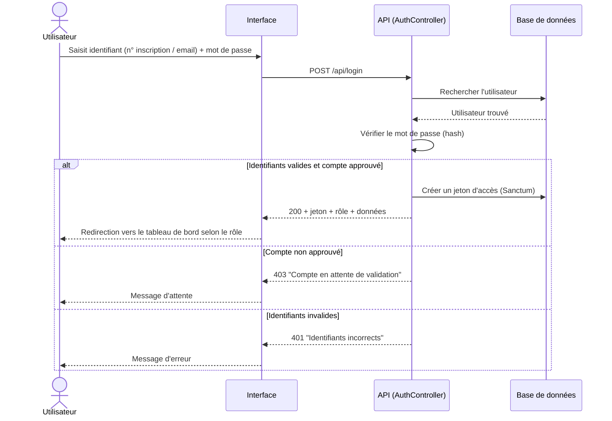

## A.2 Inscription en ligne (Register)

> *Route : `POST /api/register` — AuthController@register*

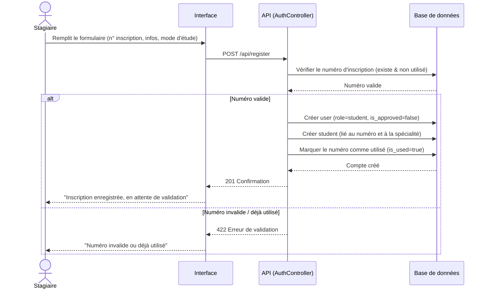

## A.3 Vérification d'un numéro d'inscription (Lookup)

> *Route : `POST /api/lookup-registration` — AuthController@lookupRegistrationNumber*

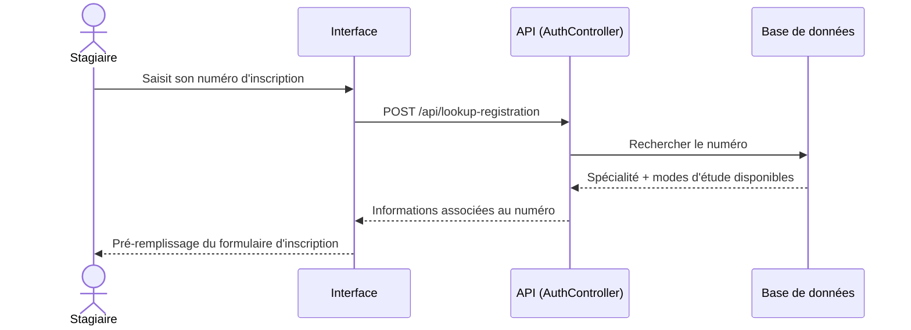

## A.4 Déconnexion (Logout)

> *Route : `POST /api/logout` — AuthController@logout*

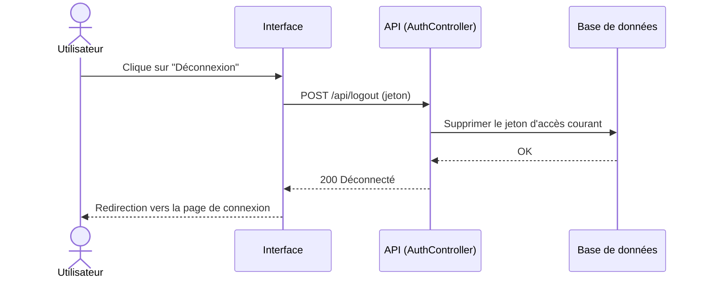

## A.5 Consulter le profil courant (Me)

> *Route : `GET /api/me` — AuthController@me*

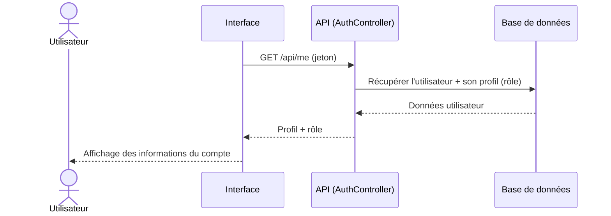

## A.6 Changer le mot de passe

> *Route : `POST /api/change-password` — AuthController@changePassword*

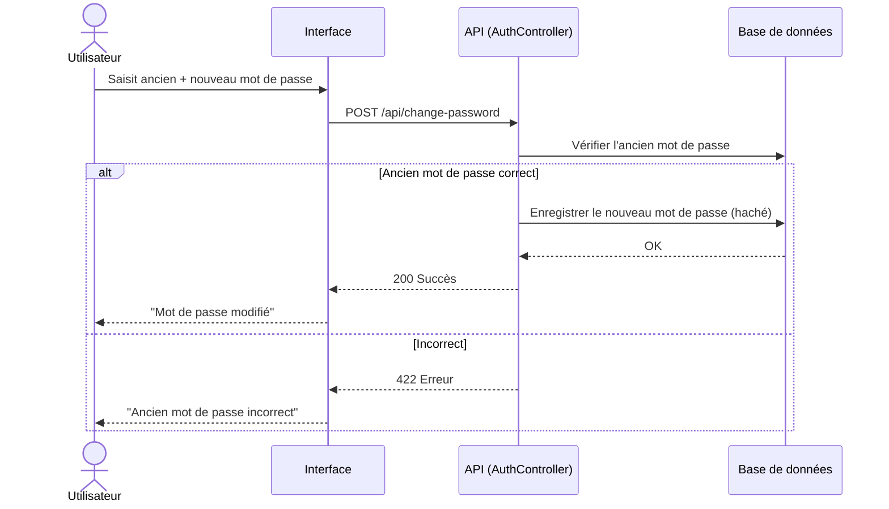

---

# B. Espace Stagiaire

## B.1 Consulter le tableau de bord

> *Route : `GET /student/dashboard` — StudentController@dashboard*

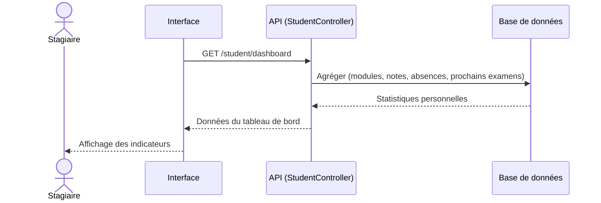

## B.2 Consulter et modifier le profil

> *Routes : `GET /student/profile`, `PUT /student/profile` — StudentController*

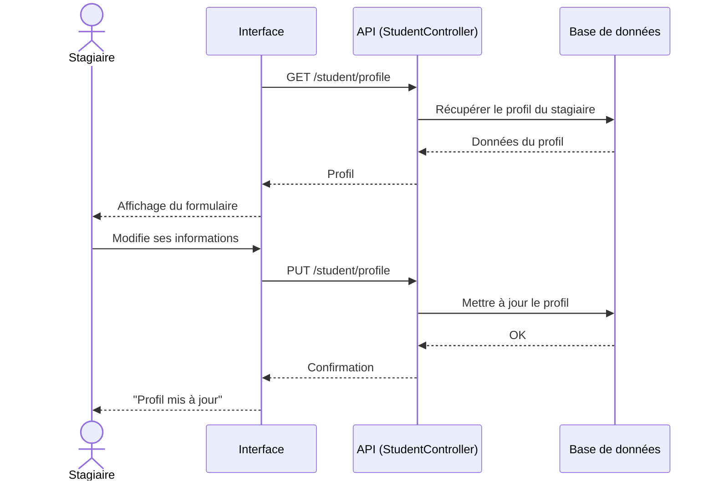

## B.3 Compléter le profil

> *Route : `POST /student/complete-profile` — StudentController@completeProfile*

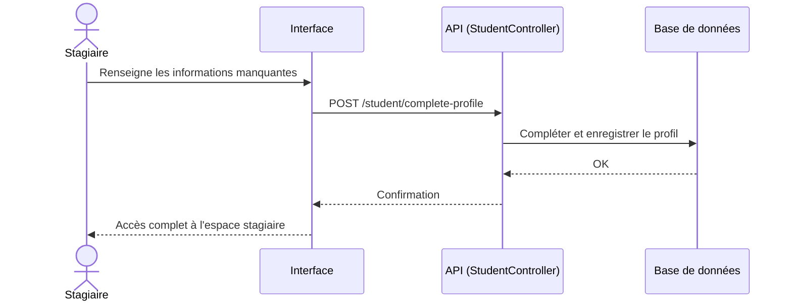

## B.4 Consulter les modules

> *Route : `GET /student/modules` — StudentController@modules*

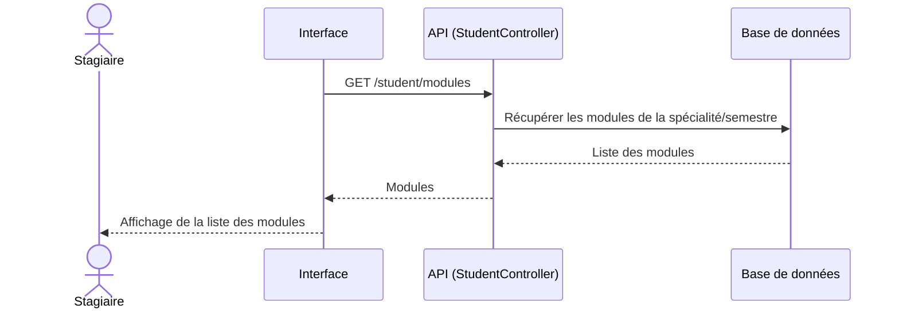

## B.5 Consulter les notes

> *Route : `GET /student/grades` — StudentController@grades*

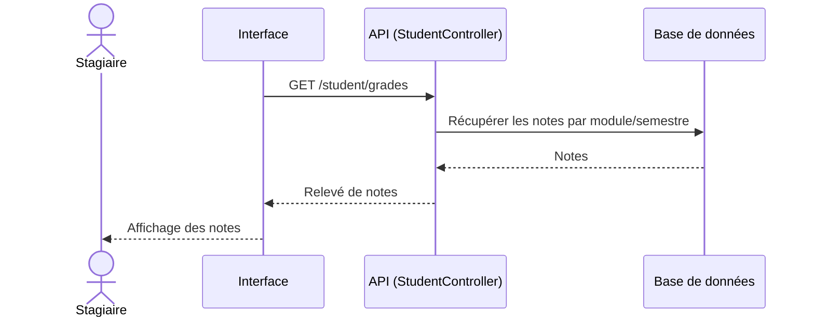

## B.6 Consulter l'assiduité

> *Route : `GET /student/attendance` — StudentController@attendance*

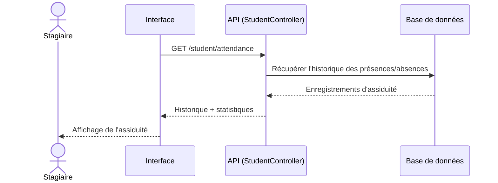

## B.7 Consulter l'emploi du temps

> *Route : `GET /student/schedule` — StudentController@schedule*

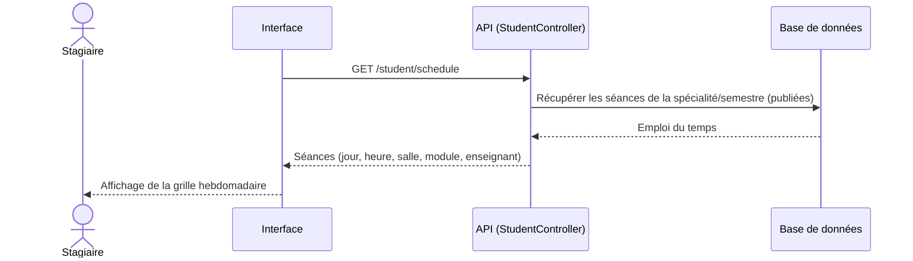

## B.8 Consulter et télécharger un cours

> *Routes : `GET /student/lessons/modules`, `GET /student/lessons/{id}/download` — LessonController*

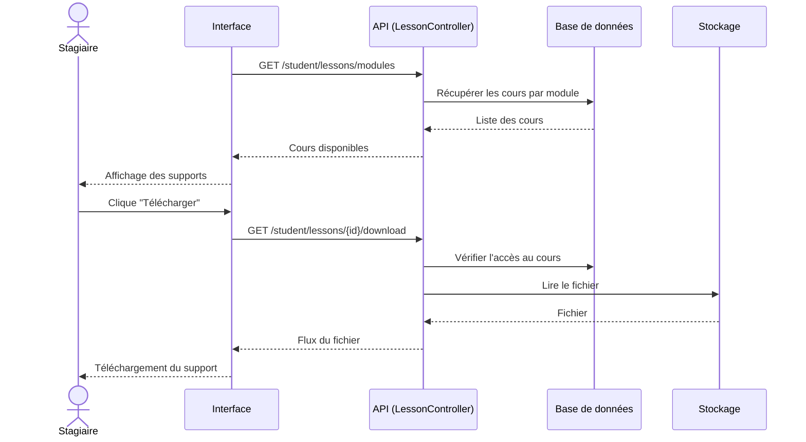

## B.9 Consulter les devoirs

> *Route : `GET /student/homeworks` — StudentHomeworkController@index*

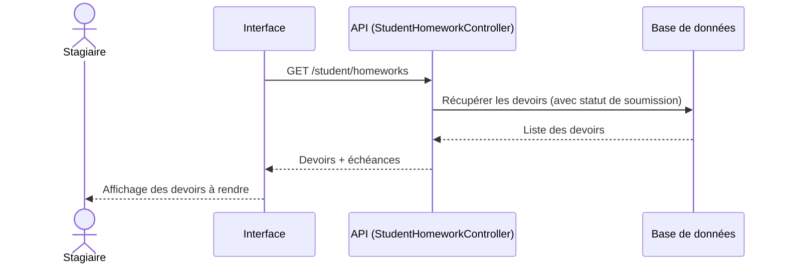

## B.10 Soumettre un devoir

> *Route : `POST /student/homeworks/{id}/submit` — StudentHomeworkController@submit*

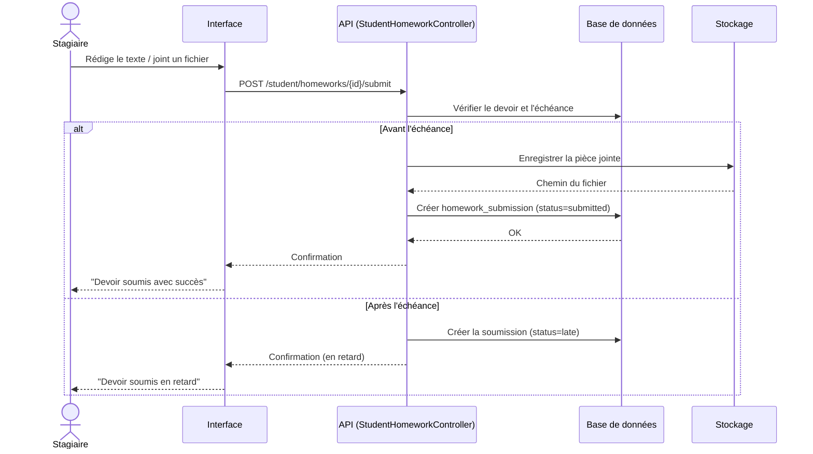

## B.11 Consulter les résultats et examens à venir

> *Routes : `GET /student/exams/results`, `GET /student/exams/upcoming` — StudentController*

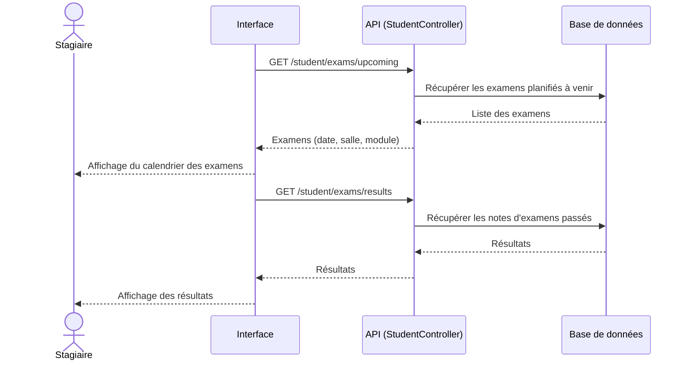

## B.12 Consulter les délibérations

> *Route : `GET /student/deliberations` — StudentDeliberationController@index*

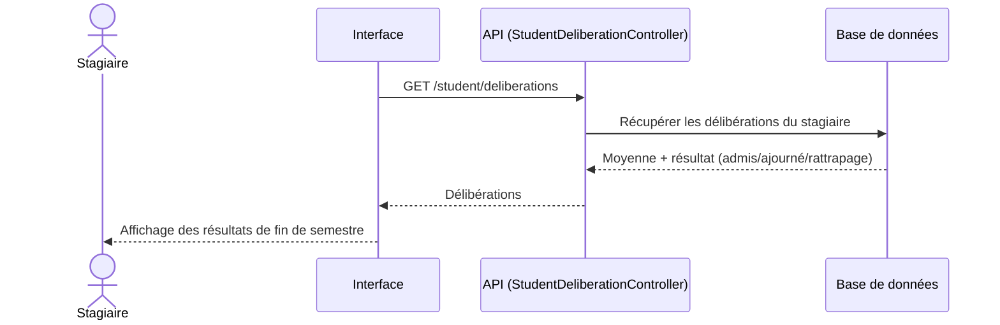

## B.13 Consulter et télécharger des documents

> *Routes : `GET /student/documents`, `GET /student/documents/{id}/download` — DocumentController*

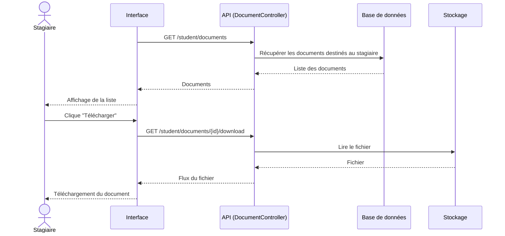

## B.14 Consulter la messagerie

> *Routes : `GET /student/messages`, `GET /student/messages/{id}` — MessageController*

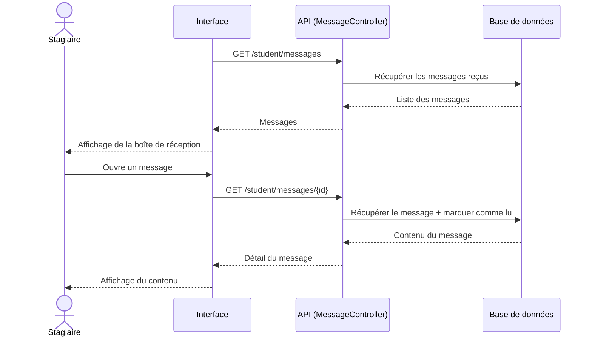

---

# C. Espace Enseignant

## C.1 Consulter le tableau de bord

> *Route : `GET /teacher/dashboard` — TeacherController@dashboard*

```mermaid
sequenceDiagram
    actor E as Enseignant
    participant F as Interface
    participant A as API (TeacherController)
    participant DB as Base de données
    F->>A: GET /teacher/dashboard
    A->>DB: Agréger (modules, séances du jour, devoirs à corriger)
    DB-->>A: Statistiques
    A-->>F: Données du tableau de bord
    F-->>E: Affichage des indicateurs
```

## C.2 Consulter et modifier le profil

> *Routes : `GET /teacher/profile`, `PUT /teacher/profile` — TeacherController*

```mermaid
sequenceDiagram
    actor E as Enseignant
    participant F as Interface
    participant A as API (TeacherController)
    participant DB as Base de données
    F->>A: GET /teacher/profile
    A->>DB: Récupérer le profil
    DB-->>A: Données
    A-->>F: Profil
    E->>F: Modifie ses informations
    F->>A: PUT /teacher/profile
    A->>DB: Mettre à jour le profil
    DB-->>A: OK
    A-->>F: Confirmation
    F-->>E: "Profil mis à jour"
```

## C.3 Consulter les modules et les stagiaires d'un module

> *Routes : `GET /teacher/modules`, `GET /teacher/modules/{module}/students` — TeacherController*

```mermaid
sequenceDiagram
    actor E as Enseignant
    participant F as Interface
    participant A as API (TeacherController)
    participant DB as Base de données
    F->>A: GET /teacher/modules
    A->>DB: Récupérer les modules affectés à l'enseignant
    DB-->>A: Liste des modules
    A-->>F: Modules
    E->>F: Sélectionne un module
    F->>A: GET /teacher/modules/{module}/students
    A->>DB: Récupérer les stagiaires inscrits au module
    DB-->>A: Liste des stagiaires
    A-->>F: Stagiaires
    F-->>E: Affichage de la liste
```

## C.4 Déposer un cours

> *Route : `POST /teacher/courses` — TeacherLessonController@store*

```mermaid
sequenceDiagram
    actor E as Enseignant
    participant F as Interface
    participant A as API (TeacherLessonController)
    participant DB as Base de données
    participant ST as Stockage
    E->>F: Renseigne titre + sélectionne fichier
    F->>A: POST /teacher/courses
    A->>ST: Enregistrer le fichier du cours
    ST-->>A: Chemin du fichier
    A->>DB: Créer le cours (lesson) lié au module
    DB-->>A: OK
    A-->>F: Confirmation
    F-->>E: "Cours publié"
```

## C.5 Supprimer un cours

> *Route : `DELETE /teacher/courses/{id}` — TeacherLessonController@destroy*

```mermaid
sequenceDiagram
    actor E as Enseignant
    participant F as Interface
    participant A as API (TeacherLessonController)
    participant DB as Base de données
    participant ST as Stockage
    E->>F: Clique "Supprimer" sur un cours
    F->>A: DELETE /teacher/courses/{id}
    A->>DB: Vérifier que le cours appartient à l'enseignant
    A->>ST: Supprimer le fichier
    A->>DB: Supprimer l'enregistrement
    DB-->>A: OK
    A-->>F: Confirmation
    F-->>E: "Cours supprimé"
```

## C.6 Marquer l'assiduité

> *Routes : `GET /teacher/attendance/sessions/{schedule}/students`, `POST /teacher/attendance` — TeacherAttendanceController*

```mermaid
sequenceDiagram
    actor E as Enseignant
    participant F as Interface
    participant A as API (TeacherAttendanceController)
    participant DB as Base de données
    E->>F: Sélectionne une séance
    F->>A: GET /teacher/attendance/sessions/{schedule}/students
    A->>DB: Récupérer les stagiaires de la séance
    DB-->>A: Liste des stagiaires
    A-->>F: Liste à pointer
    E->>F: Coche présent / absent / retard / excusé
    F->>A: POST /teacher/attendance
    A->>DB: Enregistrer les présences (date, statut)
    DB-->>A: OK
    A-->>F: Confirmation
    F-->>E: "Assiduité enregistrée"
```

## C.7 Consulter l'historique d'assiduité

> *Route : `GET /teacher/attendance/history` — TeacherAttendanceController@history*

```mermaid
sequenceDiagram
    actor E as Enseignant
    participant F as Interface
    participant A as API (TeacherAttendanceController)
    participant DB as Base de données
    F->>A: GET /teacher/attendance/history
    A->>DB: Récupérer les séances pointées par l'enseignant
    DB-->>A: Historique
    A-->>F: Historique des présences
    F-->>E: Affichage de l'historique
```

## C.8 Créer un examen

> *Route : `POST /teacher/exams` — TeacherGradesController@storeExam*

```mermaid
sequenceDiagram
    actor E as Enseignant
    participant F as Interface
    participant A as API (TeacherGradesController)
    participant DB as Base de données
    E->>F: Renseigne (module, type, date, durée, salle)
    F->>A: POST /teacher/exams
    A->>DB: Valider et créer l'examen
    DB-->>A: Examen créé
    A-->>F: Confirmation
    F-->>E: "Examen planifié"
```

## C.9 Modifier un examen / changer son statut

> *Routes : `PUT /teacher/exams/{exam}`, `PUT /teacher/exams/{exam}/status` — TeacherGradesController*

```mermaid
sequenceDiagram
    actor E as Enseignant
    participant F as Interface
    participant A as API (TeacherGradesController)
    participant DB as Base de données
    E->>F: Modifie les détails / change le statut
    F->>A: PUT /teacher/exams/{exam} (ou /status)
    A->>DB: Mettre à jour l'examen
    DB-->>A: OK
    A-->>F: Confirmation
    F-->>E: "Examen mis à jour"
```

## C.10 Saisir les notes d'un examen

> *Routes : `GET /teacher/exams/{exam}/students`, `POST /teacher/exams/{exam}/results` — TeacherGradesController*

```mermaid
sequenceDiagram
    actor E as Enseignant
    participant F as Interface
    participant A as API (TeacherGradesController)
    participant DB as Base de données
    E->>F: Sélectionne un examen
    F->>A: GET /teacher/exams/{exam}/students
    A->>DB: Récupérer les stagiaires concernés
    DB-->>A: Liste des stagiaires
    A-->>F: Grille de saisie
    E->>F: Saisit les notes (0–20)
    F->>A: POST /teacher/exams/{exam}/results
    A->>A: Valider les notes
    A->>DB: Enregistrer les notes (table grades)
    DB-->>A: OK
    A-->>F: Confirmation
    F-->>E: "Notes enregistrées"
```

## C.11 Créer un devoir

> *Route : `POST /teacher/homeworks` — TeacherHomeworkController@store*

```mermaid
sequenceDiagram
    actor E as Enseignant
    participant F as Interface
    participant A as API (TeacherHomeworkController)
    participant DB as Base de données
    participant ST as Stockage
    E->>F: Renseigne (module, titre, échéance, type, fichier)
    F->>A: POST /teacher/homeworks
    opt Fichier joint
        A->>ST: Enregistrer le fichier
        ST-->>A: Chemin
    end
    A->>DB: Créer le devoir (homework)
    DB-->>A: OK
    A-->>F: Confirmation
    F-->>E: "Devoir créé"
```

## C.12 Consulter et noter une soumission de devoir

> *Routes : `GET /teacher/homeworks/{id}`, `POST /teacher/homeworks/{homework}/submissions/{submission}/grade` — TeacherHomeworkController*

```mermaid
sequenceDiagram
    actor E as Enseignant
    participant F as Interface
    participant A as API (TeacherHomeworkController)
    participant DB as Base de données
    F->>A: GET /teacher/homeworks/{id}
    A->>DB: Récupérer le devoir + les soumissions
    DB-->>A: Soumissions des stagiaires
    A-->>F: Liste des soumissions
    E->>F: Saisit note + commentaire
    F->>A: POST /teacher/homeworks/{homework}/submissions/{submission}/grade
    A->>DB: Enregistrer la note (status=graded)
    DB-->>A: OK
    A-->>F: Confirmation
    F-->>E: "Soumission notée"
```

## C.13 Consulter l'emploi du temps

> *Route : `GET /teacher/schedule` — TeacherController@schedule*

```mermaid
sequenceDiagram
    actor E as Enseignant
    participant F as Interface
    participant A as API (TeacherController)
    participant DB as Base de données
    F->>A: GET /teacher/schedule
    A->>DB: Récupérer les séances de l'enseignant
    DB-->>A: Emploi du temps
    A-->>F: Séances
    F-->>E: Affichage de la grille hebdomadaire
```

---

# D. Espace Administration

## D.1 Consulter le tableau de bord et les statistiques

> *Routes : `GET /admin/dashboard`, `GET /admin/statistics`, `GET /admin/charts/*` — AdminController*

```mermaid
sequenceDiagram
    actor AD as Administration
    participant F as Interface
    participant A as API (AdminController)
    participant DB as Base de données
    F->>A: GET /admin/dashboard
    A->>DB: Agréger (stagiaires, enseignants, modules, spécialités)
    DB-->>A: Compteurs globaux
    A-->>F: Indicateurs clés
    F->>A: GET /admin/charts/students-by-specialty
    A->>DB: Compter les stagiaires par spécialité
    DB-->>A: Répartition
    A-->>F: Données des graphiques
    F-->>AD: Affichage du tableau de bord et des graphiques
```

## D.2 Générer un numéro d'inscription

> *Route : `POST /admin/generate-registration` — AdminController@generateRegistrationNumber*

```mermaid
sequenceDiagram
    actor AD as Administration
    participant F as Interface
    participant A as API (AdminController)
    participant DB as Base de données
    AD->>F: Choisit la spécialité et la session
    F->>A: POST /admin/generate-registration
    A->>DB: Rechercher le dernier numéro (code spécialité + année)
    DB-->>A: Dernier numéro
    A->>A: Calculer la séquence suivante (code + année + n° sur 4 chiffres)
    A->>DB: Créer le numéro d'inscription (is_used=false)
    DB-->>A: OK
    A-->>F: Numéro généré
    F-->>AD: Affichage du nouveau numéro
```

## D.3 Gérer les stagiaires (Créer / Modifier / Supprimer)

> *Routes : `POST/PUT/DELETE /admin/students` — AdminController*

```mermaid
sequenceDiagram
    actor AD as Administration
    participant F as Interface
    participant A as API (AdminController)
    participant DB as Base de données
    AD->>F: Saisit / modifie les données du stagiaire
    F->>A: POST /admin/students (ou PUT /admin/students/{id})
    A->>A: Valider les données
    A->>DB: Créer / mettre à jour le user + student
    DB-->>A: OK
    A-->>F: Confirmation
    F-->>AD: "Stagiaire enregistré"
    AD->>F: Clique "Supprimer"
    F->>A: DELETE /admin/students/{id}
    A->>DB: Supprimer le stagiaire (cascade)
    DB-->>A: OK
    A-->>F: Confirmation
    F-->>AD: "Stagiaire supprimé"
```

## D.4 Approuver ou rejeter une inscription

> *Routes : `GET /admin/pending-registrations`, `POST /admin/students/{id}/approve`, `POST /admin/students/{id}/reject` — AdminController*

```mermaid
sequenceDiagram
    actor AD as Administration
    participant F as Interface
    participant A as API (AdminController)
    participant DB as Base de données
    F->>A: GET /admin/pending-registrations
    A->>DB: Récupérer les comptes non approuvés
    DB-->>A: Liste des inscriptions en attente
    A-->>F: Liste
    F-->>AD: Affichage des demandes
    alt Approbation
        AD->>F: Clique "Approuver"
        F->>A: POST /admin/students/{id}/approve
        A->>DB: Mettre is_approved = true
        DB-->>A: OK
        A-->>F: Confirmation
        F-->>AD: "Inscription approuvée"
    else Rejet
        AD->>F: Clique "Rejeter"
        F->>A: POST /admin/students/{id}/reject
        A->>DB: Rejeter / supprimer la demande
        DB-->>A: OK
        A-->>F: Confirmation
        F-->>AD: "Inscription rejetée"
    end
```

## D.5 Réinitialiser le mot de passe d'un stagiaire / enseignant

> *Routes : `POST /admin/students/{id}/reset-password`, `POST /admin/teachers/{id}/reset-password` — AdminController*

```mermaid
sequenceDiagram
    actor AD as Administration
    participant F as Interface
    participant A as API (AdminController)
    participant DB as Base de données
    AD->>F: Clique "Réinitialiser le mot de passe"
    F->>A: POST /admin/students/{id}/reset-password
    A->>A: Générer un nouveau mot de passe
    A->>DB: Enregistrer le mot de passe (haché)
    DB-->>A: OK
    A-->>F: Nouveau mot de passe
    F-->>AD: Affichage / communication du mot de passe
```

## D.6 Gérer les enseignants (Créer / Modifier / Supprimer)

> *Routes : `POST/PUT/DELETE /admin/teachers` — AdminController*

```mermaid
sequenceDiagram
    actor AD as Administration
    participant F as Interface
    participant A as API (AdminController)
    participant DB as Base de données
    AD->>F: Saisit / modifie les données de l'enseignant
    F->>A: POST /admin/teachers (ou PUT /admin/teachers/{id})
    A->>A: Valider les données
    A->>DB: Créer / mettre à jour le user + teacher
    DB-->>A: OK
    A-->>F: Confirmation
    F-->>AD: "Enseignant enregistré"
```

## D.7 Affecter / retirer un enseignant d'un module

> *Routes : `POST /admin/modules/assign-teacher`, `POST /admin/modules/remove-teacher` — AdminController*

```mermaid
sequenceDiagram
    actor AD as Administration
    participant F as Interface
    participant A as API (AdminController)
    participant DB as Base de données
    AD->>F: Sélectionne un module et un enseignant
    F->>A: POST /admin/modules/assign-teacher
    A->>DB: Créer l'association teacher_module
    DB-->>A: OK
    A-->>F: Confirmation
    F-->>AD: "Enseignant affecté au module"
    AD->>F: Retirer un enseignant
    F->>A: POST /admin/modules/remove-teacher
    A->>DB: Supprimer l'association
    DB-->>A: OK
    A-->>F: Confirmation
    F-->>AD: "Enseignant retiré"
```

## D.8 Gérer les spécialités (CRUD)

> *Routes : `POST/PUT/DELETE /admin/specialties` — SpecialtyController*

```mermaid
sequenceDiagram
    actor AD as Administration
    participant F as Interface
    participant A as API (SpecialtyController)
    participant DB as Base de données
    AD->>F: Saisit / modifie une spécialité
    F->>A: POST /admin/specialties (ou PUT /{id})
    A->>A: Valider (nom, code unique, durée)
    A->>DB: Créer / mettre à jour la spécialité
    DB-->>A: OK
    A-->>F: Confirmation
    F-->>AD: "Spécialité enregistrée"
    AD->>F: Supprimer
    F->>A: DELETE /admin/specialties/{id}
    A->>DB: Supprimer la spécialité
    DB-->>A: OK
    A-->>F: Confirmation
    F-->>AD: "Spécialité supprimée"
```

## D.9 Gérer les modules (CRUD)

> *Routes : `POST/PUT/DELETE /admin/modules` — AdminController*

```mermaid
sequenceDiagram
    actor AD as Administration
    participant F as Interface
    participant A as API (AdminController)
    participant DB as Base de données
    AD->>F: Saisit / modifie un module (spécialité, semestre, coefficient)
    F->>A: POST /admin/modules (ou PUT /{id})
    A->>A: Valider les données
    A->>DB: Créer / mettre à jour le module
    DB-->>A: OK
    A-->>F: Confirmation
    F-->>AD: "Module enregistré"
```

## D.10 Créer une séance d'emploi du temps (avec prévention de conflit)

> *Route : `POST /admin/schedules` — ScheduleController@store*

```mermaid
sequenceDiagram
    actor AD as Administration
    participant F as Interface
    participant A as API (ScheduleController)
    participant DB as Base de données
    AD->>F: Saisit (module, enseignant, jour, horaire, salle)
    F->>A: POST /admin/schedules
    A->>DB: Vérifier les conflits de l'enseignant (jour, chevauchement horaire)
    DB-->>A: Résultat de la vérification
    alt Aucun conflit
        A->>DB: Enregistrer la séance
        DB-->>A: OK
        A-->>F: Confirmation
        F-->>AD: "Séance ajoutée à l'emploi du temps"
    else Conflit détecté
        A-->>F: 422 "Conflit : l'enseignant a déjà une séance"
        F-->>AD: Message de conflit
    end
```

## D.11 Modifier / supprimer une séance

> *Routes : `PUT/DELETE /admin/schedules/{id}` — ScheduleController*

```mermaid
sequenceDiagram
    actor AD as Administration
    participant F as Interface
    participant A as API (ScheduleController)
    participant DB as Base de données
    AD->>F: Modifie ou supprime une séance
    F->>A: PUT /admin/schedules/{id} (ou DELETE)
    A->>DB: Vérifier les conflits (si modification)
    A->>DB: Mettre à jour / supprimer la séance
    DB-->>A: OK
    A-->>F: Confirmation
    F-->>AD: "Emploi du temps mis à jour"
```

## D.12 Publier / dépublier un emploi du temps

> *Routes : `POST /admin/schedules/sessions/{sessionId}/publish`, `.../unpublish` — ScheduleController*

```mermaid
sequenceDiagram
    actor AD as Administration
    participant F as Interface
    participant A as API (ScheduleController)
    participant DB as Base de données
    AD->>F: Choisit la spécialité et clique "Publier"
    F->>A: POST /admin/schedules/sessions/{sessionId}/publish
    A->>DB: Mettre à jour le statut (publié)
    DB-->>A: OK
    A-->>F: Confirmation
    F-->>AD: "Emploi du temps publié (visible par les stagiaires)"
```

## D.13 Gérer les sessions / promotions (CRUD + activation)

> *Routes : `POST/PUT/DELETE /admin/sessions`, `POST /admin/sessions/{id}/activate` — SessionController*

```mermaid
sequenceDiagram
    actor AD as Administration
    participant F as Interface
    participant A as API (SessionController)
    participant DB as Base de données
    AD->>F: Saisit une session (mois, année)
    F->>A: POST /admin/sessions
    A->>A: Calculer la date de fin (durée du cycle)
    A->>DB: Créer la session
    DB-->>A: OK
    A-->>F: Confirmation
    AD->>F: Activer une session
    F->>A: POST /admin/sessions/{id}/activate
    A->>DB: Mettre is_active = true
    DB-->>A: OK
    A-->>F: Confirmation
    F-->>AD: "Session active"
```

## D.14 Associer / dissocier une spécialité à une session

> *Routes : `POST /admin/sessions/{id}/specialties`, `DELETE /admin/sessions/{id}/specialties/{ssId}` — SessionController*

```mermaid
sequenceDiagram
    actor AD as Administration
    participant F as Interface
    participant A as API (SessionController)
    participant DB as Base de données
    AD->>F: Sélectionne une spécialité pour la session
    F->>A: POST /admin/sessions/{id}/specialties
    A->>DB: Créer l'association session_specialty
    DB-->>A: OK
    A-->>F: Confirmation
    F-->>AD: "Spécialité associée à la session"
```

## D.15 Envoyer un message / une diffusion

> *Route : `POST /admin/messages/send` — AdminMessageController@sendMessage*

```mermaid
sequenceDiagram
    actor AD as Administration
    participant F as Interface
    participant A as API (AdminMessageController)
    participant DB as Base de données
    AD->>F: Rédige le message + choisit les destinataires
    F->>A: POST /admin/messages/send (recipient_type)
    alt Diffusion (tous / stagiaires / enseignants / spécialité)
        A->>DB: Récupérer les destinataires ciblés
        DB-->>A: Liste des destinataires
        A->>DB: Créer un message pour chaque destinataire
    else Message individuel
        A->>DB: Créer un message pour le destinataire
    end
    DB-->>A: OK
    A-->>F: Confirmation
    F-->>AD: "Message envoyé"
```

## D.16 Gérer les documents (Déposer / Supprimer)

> *Routes : `POST /admin/documents`, `DELETE /admin/documents/{id}` — AdminDocumentController*

```mermaid
sequenceDiagram
    actor AD as Administration
    participant F as Interface
    participant A as API (AdminDocumentController)
    participant DB as Base de données
    participant ST as Stockage
    AD->>F: Sélectionne un fichier + cible (public / session / spécialité)
    F->>A: POST /admin/documents
    A->>ST: Enregistrer le fichier
    ST-->>A: Chemin du fichier
    A->>DB: Créer le document (avec ciblage)
    DB-->>A: OK
    A-->>F: Confirmation
    F-->>AD: "Document publié"
    AD->>F: Supprimer un document
    F->>A: DELETE /admin/documents/{id}
    A->>ST: Supprimer le fichier
    A->>DB: Supprimer l'enregistrement
    DB-->>A: OK
    A-->>F: Confirmation
    F-->>AD: "Document supprimé"
```

## D.17 Gérer les délibérations (calcul et validation)

> *Routes : `GET /admin/deliberations`, `POST /admin/deliberations` — AdminDeliberationController*

```mermaid
sequenceDiagram
    actor AD as Administration
    participant F as Interface
    participant A as API (AdminDeliberationController)
    participant DB as Base de données
    F->>A: GET /admin/deliberations?semestre
    A->>DB: Récupérer les notes des stagiaires + coefficients
    DB-->>A: Notes par module
    A->>A: Calculer la moyenne pondérée par coefficient
    A->>A: Déterminer le résultat (moyenne ≥ 10 → admis, sinon ajourné)
    A-->>F: Moyennes + résultats proposés
    F-->>AD: Affichage de la grille de délibération
    AD->>F: Valide / ajuste les résultats + observations
    F->>A: POST /admin/deliberations
    A->>DB: Enregistrer la délibération (moyenne, résultat)
    DB-->>A: OK
    A-->>F: Confirmation
    F-->>AD: "Délibération validée"
```

---

# E. Module transversal : Assistant intelligent (Chatbot)

## E.1 Poser une question au chatbot

> *Route : `POST /api/chatbot` — ChatbotController@chat*

```mermaid
sequenceDiagram
    actor U as Utilisateur
    participant F as Interface
    participant A as API (ChatbotController)
    participant G as API Gemini
    U->>F: Saisit une question
    F->>A: POST /api/chatbot (message)
    A->>A: Préparer le contexte (rôle / FAQ)
    A->>G: Envoyer la requête à l'API Gemini
    G-->>A: Réponse générée
    A-->>F: Réponse formatée
    F-->>U: Affichage de la réponse de l'assistant
```

---
