# République Algérienne Démocratique et Populaire
## Ministère de la Formation et de l'Enseignement Professionnels
### Institut National Spécialisé de la Formation Professionnelle

---

# Mémoire de Fin d'Étude

**En vue de l'obtention du diplôme de**
**Technicien Supérieur en Informatique**

**Option : Développement Web et Mobile**

---

## Thème :

# Conception et réalisation d'une plateforme web et mobile pour la gestion intégrée d'un institut de formation professionnelle (INSFP)

---

**Organisme d'accueil :** Institut National Spécialisé de la Formation Professionnelle (INSFP)

**Promoteur / Encadreur :** ........................................

**Réalisé par :**
- ........................................
- ........................................

**Session : Octobre 2026**

---
---

# Remerciements

L'aboutissement de ce travail est le fruit d'un engagement personnel soutenu, mais il n'aurait pu se concrétiser sans l'aide, les conseils et le soutien de plusieurs personnes et institutions que nous tenons à remercier chaleureusement.

Nos plus profonds remerciements s'adressent à notre encadreur, **................................**, dont la rigueur scientifique, la disponibilité constante et les précieux conseils ont été déterminants pour l'élaboration et la bonne marche de ce mémoire. Sa confiance et ses encouragements tout au long de ce parcours ont été une source de motivation essentielle.

Nos remerciements vont également aux responsables de **l'Institut National Spécialisé de la Formation Professionnelle** pour avoir fourni le cadre académique et les ressources nécessaires à la conduite de ce projet, ainsi que pour la facilité d'accès aux informations et aux infrastructures qui a été cruciale pour la partie pratique de notre travail.

Nous sommes reconnaissants envers l'ensemble du corps professoral qui a contribué à notre formation et nous adressons nos remerciements sincères à nos enseignants durant tout ce parcours d'apprentissage.

Enfin, nous ne saurions terminer sans une pensée pour nos chères familles et nos amis, dont le soutien inconditionnel, la patience et les encouragements constants ont été une force motrice tout au long de ces années.

---
---

# Dédicace

Nous dédions ce travail, fruit de longues heures de labeur et de passion, à ceux qui nous sont les plus chers et qui ont été une source de soutien et d'inspiration inestimable.

À nos très chers parents, pour leur amour inconditionnel et leurs sacrifices. Qu'ils trouvent ici le témoignage de notre profonde gratitude et de notre respect éternel.

À toutes nos familles, nos piliers, pour leur soutien constant et leur présence réconfortante.

À nos chers amis et camarades de promotion, pour leur soutien moral et professionnel ; nos échanges, leurs conseils et leur amitié ont été des atouts précieux.

À tous ceux qui nous ont soutenus de près ou de loin dans ce long cheminement.

---
---

# Table des matières

- **Remerciements**
- **Dédicace**
- **Table des matières**
- **Liste des abréviations**
- **Introduction Générale**
  1. Introduction
  2. Présentation du sujet
     - 2.1 Problématique
     - 2.2 Objectifs
- **Chapitre I : Étude préalable**
  1. Présentation de l'organisme d'accueil
     - 1.1 Présentation de l'INSFP
     - 1.2 Missions de l'INSFP
     - 1.3 Organigramme de l'INSFP
     - 1.4 Moyens informatiques et humains
- **Chapitre II : Étude du système existant et analyse des besoins**
  1. Concepts liés à la gestion d'un institut de formation
  2. Étude et critique du système existant
  3. Préparation du cahier des charges
     - 3.1 Besoins fonctionnels
     - 3.2 Besoins non fonctionnels
  4. Méthodologie de développement « SCRUM »
  5. Planification des sprints et Backlog
  6. Identification des acteurs
- **Chapitre III : Conception et Modélisation**
  1. Le langage de modélisation UML
  2. Diagrammes de cas d'utilisation
  3. Diagrammes de séquence
  4. Diagramme d'activité
  5. Diagramme de classes
     - 5.1 Dictionnaire de données
     - 5.2 Règles de gestion
  6. Modèle relationnel
  7. Conception des interfaces (arborescence, maquettes, charte graphique)
  8. Architecture de la solution
- **Chapitre IV : Réalisation**
  1. Environnement et outils de développement
  2. Langages et frameworks utilisés
  3. Implémentation de la base de données
  4. Présentation des interfaces de l'application
- **Conclusion Générale**

---
---

# Liste des abréviations

| Abréviation | Signification |
|-------------|---------------|
| INSFP | Institut National Spécialisé de la Formation Professionnelle |
| MFEP | Ministère de la Formation et de l'Enseignement Professionnels |
| API | Application Programming Interface |
| REST | Representational State Transfer |
| JWT | JSON Web Token |
| SPA | Single Page Application |
| UML | Unified Modeling Language |
| MVC | Model View Controller |
| ORM | Object Relational Mapping |
| CRUD | Create, Read, Update, Delete |
| SQL | Structured Query Language |
| HTML | HyperText Markup Language |
| CSS | Cascading Style Sheets |
| JS | JavaScript |
| PHP | Hypertext Preprocessor |
| HTTP | HyperText Transfer Protocol |
| JSON | JavaScript Object Notation |
| PDF | Portable Document Format |
| VSC | Visual Studio Code |
| BDD | Base De Données |
| TS | Technicien Supérieur |
| MCD / MLD | Modèle Conceptuel / Logique de Données |
| MOR | Modèle Objet Relationnel |
| UI / UX | User Interface / User Experience |
| SI | Système d'Information |

---
---

# Introduction Générale

## 1. Introduction

Dans le contexte actuel de transformation numérique, la gestion administrative et pédagogique des établissements de formation représente un enjeu stratégique majeur. La digitalisation des processus permet d'assurer un service de qualité aux apprenants, d'optimiser le travail du personnel et de garantir la traçabilité de l'information.

L'**Institut National Spécialisé de la Formation Professionnelle (INSFP)**, en tant qu'établissement public relevant du Ministère de la Formation et de l'Enseignement Professionnels (MFEP), assure la formation de techniciens et techniciens supérieurs dans plusieurs spécialités. La gestion quotidienne d'un tel établissement met en jeu un volume important d'informations : inscriptions des stagiaires, affectation des enseignants, élaboration des emplois du temps, suivi de l'assiduité, saisie et consultation des notes, gestion des examens, délibérations de fin de semestre, distribution de documents officiels et communication interne.

Aujourd'hui, une grande partie de ces activités est encore traitée de manière classique (sur papier ou via des fichiers bureautiques séparés et peu synchronisés), ce qui engendre une perte de temps, des risques d'erreurs et une difficulté d'accès à l'information.

C'est dans cette vision que s'inscrit notre projet de fin d'étude : **la conception et la réalisation d'une plateforme numérique complète et centralisée**, composée d'une **application web** destinée à l'administration et aux enseignants, et d'une **application mobile** destinée aux stagiaires et aux enseignants, afin de moderniser et de fluidifier l'ensemble des activités de l'institut.

## 2. Présentation du sujet

L'INSFP fait face à un besoin croissant de **centralisation** et de **numérisation** de sa gestion administrative et pédagogique, afin de garantir un meilleur service aux stagiaires et un travail plus efficace au personnel.

C'est dans cette perspective que notre choix de sujet relève, et afin de faire face à cette problématique, notre projet est : **« la conception et la réalisation d'une plateforme web et mobile pour la gestion intégrée de l'INSFP »**.

Cette plateforme s'adresse principalement à quatre profils d'utilisateurs : l'**administration**, les **enseignants**, les **stagiaires**, ainsi qu'un **administrateur système** chargé de la supervision globale.

### 2.1 Problématique

Dans le secteur de la formation professionnelle, la performance d'un établissement est directement liée à l'efficacité de ses dispositifs de gestion administrative et pédagogique. C'est dans cette perspective que l'INSFP est confronté à la problématique suivante :

- **Comment l'INSFP peut-il transformer ses processus manuels et fastidieux (inscriptions, plannings, notes, assiduité) en une gestion numérique optimisée, centralisée et fiable ?**
- **Quelles solutions apporter à la lenteur des démarches et à l'exécution souvent manuelle des processus actuels (saisies répétitives, traitement papier des dossiers et des notes) ?**
- **Comment remédier au manque de centralisation et à la difficulté d'accès à l'information** (emplois du temps, notes, documents) **pour les stagiaires et les enseignants, particulièrement à distance ?**
- **Comment instaurer un canal de communication direct et officiel** entre l'administration, les enseignants et les stagiaires ?

### 2.2 Objectifs

La création d'une plateforme web et mobile pour la gestion de l'INSFP va permettre de :

1. **Numériser, centraliser et automatiser** les processus manuels et fastidieux de l'institut (inscriptions en ligne, génération de numéros d'inscription, validation des comptes, emplois du temps, etc.).

2. **Assurer une meilleure traçabilité** : historique des notes, des absences, des documents distribués, des messages échangés et des délibérations.

3. **Faciliter l'accès à l'information** en temps réel : chaque stagiaire et chaque enseignant peut consulter son emploi du temps, ses notes, ses devoirs et ses documents à tout moment et depuis n'importe quel appareil (web ou mobile).

4. **Améliorer la communication** grâce à un système de messagerie interne et de notifications (diffusion de l'administration vers les enseignants et stagiaires, par spécialité, par groupe ou individuellement).

5. **Collecter des données précieuses pour l'analyse** : la plateforme génère des tableaux de bord et des statistiques (répartition des stagiaires par spécialité, taux de réussite, assiduité, etc.) cruciaux pour une démarche d'amélioration continue.

---
---

# Chapitre I : Étude préalable

## 1. Présentation de l'organisme d'accueil

### 1.1 Présentation de l'INSFP

L'**Institut National Spécialisé de la Formation Professionnelle (INSFP)** est un établissement public de formation relevant du **Ministère de la Formation et de l'Enseignement Professionnels (MFEP)**. Il a pour vocation d'assurer la formation professionnelle qualifiante et diplômante de jeunes et d'adultes dans diverses spécialités techniques et tertiaires.

L'institut accueille des **stagiaires** organisés en **promotions** (sessions) et répartis en **spécialités**, chacune structurée en **modules** et en **semestres**. La formation peut se dérouler selon plusieurs **modes d'étude** :

- **Formation initiale (résidentielle / présentielle)** : le stagiaire suit sa formation à plein temps au sein de l'institut ;
- **Formation par apprentissage / alternance** : la formation est partagée entre l'institut et un milieu professionnel (entreprise) ;
- **Formation continue** : destinée aux travailleurs souhaitant se perfectionner ou se reconvertir.

À l'issue de leur cursus, les stagiaires obtiennent un diplôme reconnu par l'État (Technicien, Technicien Supérieur, etc.) selon la spécialité et le niveau suivi.

### 1.2 Missions de l'INSFP

L'INSFP a pour missions principales :

1. **La formation professionnelle qualifiante** : dispenser des formations adaptées aux besoins du marché du travail, dans différentes spécialités et selon différents modes (initial, apprentissage, continu).

2. **L'organisation pédagogique** : gérer les spécialités, les modules, l'affectation des enseignants et l'élaboration des emplois du temps.

3. **Le suivi des stagiaires** : assurer le suivi de l'assiduité, des évaluations (examens, devoirs), des résultats et des délibérations de fin de semestre.

4. **La délivrance des documents officiels** : attestations, relevés de notes, convocations, et toute pièce administrative liée à la scolarité.

5. **L'accompagnement et l'insertion** : préparer les stagiaires à l'intégration dans le monde professionnel.

### 1.3 Organigramme de l'INSFP

L'institut est organisé autour d'une **direction**, appuyée par plusieurs services (administration et scolarité, corps enseignant, services techniques et informatiques). La structure simplifiée, dans la limite de notre champ d'étude, est la suivante :

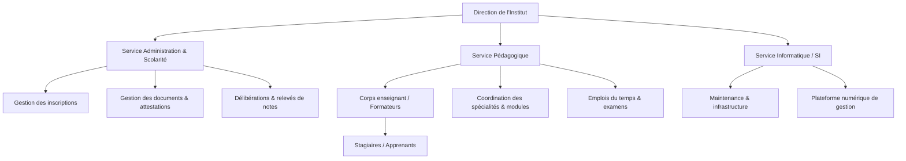

> *Figure 1.1 — Organigramme simplifié de l'INSFP*

Notre champ d'étude se concentre principalement sur le **Service Administration & Scolarité** et le **Service Pédagogique**, qui constituent le cœur métier de la plateforme.

### 1.4 Moyens informatiques et humains

L'étude des moyens informatiques et humains permet d'identifier les ressources existantes et de cadrer la solution informatique à mettre en place.

**1.4.1 Moyens matériels et logiciels :**

| Appareil / Logiciel / Outil | Type | Observation |
|---|---|---|
| PC de bureau | Poste administratif | Pour la scolarité et le service pédagogique |
| Imprimante | Laser | Édition des documents et relevés |
| Serveur | Local / hébergement | Hébergement de l'application et de la base de données |
| Connexion | Réseau filaire + Wi-Fi | Accès Internet et réseau local |
| Système d'exploitation | Windows 10/11 | Postes de travail |
| Logiciels bureautiques | Pack Office | Traitement des documents existants |

**1.4.2 Moyens humains :**

- **Personnel administratif** : chargé des inscriptions, de la scolarité, des documents et des délibérations.
- **Enseignants / Formateurs** : assurent les cours, l'assiduité, les évaluations et le suivi pédagogique.
- **Responsable informatique / SI** : assure la maintenance et l'exploitation de la solution numérique.
- **Direction** : assure la supervision et la validation des décisions.

---
---

# Chapitre II : Étude du système existant et analyse des besoins

## 1. Concepts liés à la gestion d'un institut de formation

Avant de concevoir la solution, il convient de définir les principaux concepts manipulés par l'institut :

- **Spécialité** : domaine de formation (ex. : Informatique, Comptabilité, Électrotechnique). Une spécialité possède une durée exprimée en semestres et regroupe plusieurs modules.
- **Module** : unité d'enseignement appartenant à une spécialité, rattachée à un semestre, et caractérisée par un coefficient et un volume horaire hebdomadaire.
- **Session (Promotion)** : cohorte de stagiaires démarrant leur formation à une période donnée (mois/année).
- **Stagiaire (Apprenant)** : personne inscrite dans une spécialité, identifiée par un **numéro d'inscription** unique, suivant un mode d'étude donné et progressant de semestre en semestre.
- **Enseignant (Formateur)** : personne assurant l'enseignement d'un ou plusieurs modules.
- **Emploi du temps (Schedule)** : répartition hebdomadaire des séances (module, enseignant, salle, jour, horaire) par spécialité et semestre.
- **Assiduité (Présence)** : suivi de la présence des stagiaires aux séances (présent, absent, en retard, excusé).
- **Évaluation** : examens (contrôle continu, examen final, rattrapage) et devoirs donnant lieu à des notes.
- **Délibération** : décision de fin de semestre statuant sur la réussite (admis, ajourné, rattrapage) à partir de la moyenne obtenue.

## 2. Étude et critique du système existant

Actuellement, la gestion des activités de l'institut se fait de manière classique (papier ou fichiers bureautiques séparés). Cette situation soulève d'importants défis :

- **Perte de temps et lourdeur administrative** : saisies répétitives, délais longs pour traiter les dossiers d'inscription et les notes.
- **Accès limité à l'information** : les stagiaires et enseignants ont du mal à consulter rapidement leurs emplois du temps ou leurs notes, surtout à distance.
- **Difficulté de communication** : absence d'un canal direct et officiel entre l'administration, les enseignants et les stagiaires.
- **Risques d'erreurs et de pertes** : affectation manuelle des salles favorisant les chevauchements ; archivage papier exposé aux pertes.

C'est ainsi qu'a émergé le besoin de développer une **plateforme web unifiée accompagnée d'une application mobile**, capable de résoudre ces contraintes et de fluidifier l'échange d'informations.

## 3. Préparation du cahier des charges

### 3.1 Besoins fonctionnels

Les besoins fonctionnels décrivent les services que le système doit rendre à chaque acteur.

#### a) Gestion des utilisateurs, des rôles et de l'authentification

- **Authentification sécurisée** par jeton (token JWT / Sanctum), avec identification par **numéro d'inscription** (stagiaire) ou **email** + mot de passe.
- **Gestion des rôles et permissions** avec trois rôles principaux : `administration`, `teacher` (enseignant), `student` (stagiaire).
- **Inscription en ligne** des stagiaires à l'aide d'un **numéro d'inscription** pré-généré par l'administration.
- **Workflow d'approbation** : tout nouveau compte est créé en état « non approuvé » (`is_approved = false`) et doit être validé par l'administration avant l'accès.
- **Gestion du mot de passe** : changement de mot de passe et réinitialisation par l'administration.

#### b) Espace Administration

- **Tableau de bord** avec statistiques clés : nombre de stagiaires, d'enseignants, de spécialités, répartition par spécialité, etc.
- **Gestion des spécialités et des modules** (CRUD), affectation des enseignants aux modules.
- **Gestion des sessions / promotions** (création, activation, archivage) et association des spécialités aux sessions.
- **Génération des numéros d'inscription** par session et par spécialité.
- **Gestion des stagiaires** : création, modification, suppression, approbation/rejet des inscriptions en attente, réinitialisation de mot de passe.
- **Gestion des enseignants** : CRUD, consultation de l'emploi du temps, réinitialisation de mot de passe.
- **Gestion des emplois du temps** : création des séances, prévention des conflits, publication par spécialité.
- **Gestion des documents** : dépôt et distribution ciblée (public, par session, par spécialité).
- **Messagerie / diffusion** : envoi de messages à tous, aux stagiaires, aux enseignants, par spécialité ou en individuel.
- **Délibérations** : consultation et validation des résultats de fin de semestre.

#### c) Espace Enseignant

- **Tableau de bord** personnel et consultation des **modules** enseignés.
- **Consultation de la liste des stagiaires** par module.
- **Gestion des cours / supports (lessons)** : dépôt de documents pédagogiques.
- **Gestion de l'assiduité** : marquage des présences par séance et consultation de l'historique.
- **Gestion des examens et des notes** : création d'examens, saisie et modification des notes.
- **Gestion des devoirs (homeworks)** : création de devoirs (en ligne ou en présentiel), consultation et notation des soumissions.
- **Emploi du temps** personnel et **messagerie**.

#### d) Espace Stagiaire (Web & Mobile)

- **Tableau de bord** personnel.
- **Consultation de l'emploi du temps**, des **modules** et des **cours**.
- **Consultation des notes** et des **résultats d'examens** (à venir et passés).
- **Consultation de l'assiduité** (historique et statistiques d'absences).
- **Devoirs** : consultation et **soumission en ligne** (avec pièce jointe).
- **Délibérations** : consultation des résultats de fin de semestre.
- **Documents** : téléchargement des documents qui lui sont destinés.
- **Messagerie** et **complétion du profil**.

#### e) Assistant intelligent (Chatbot)

- Intégration d'un **chatbot** basé sur une API d'intelligence artificielle (Gemini) pour l'assistance et la réponse automatisée aux questions fréquentes.

### 3.2 Besoins non fonctionnels

Les besoins non fonctionnels définissent les contraintes et qualités nécessaires à l'efficacité du système :

- **Sécurité** : authentification par jeton, hachage des mots de passe, contrôle d'accès par rôle (middleware), validation des données côté serveur.
- **Performance et réactivité** : architecture en API REST, interface web de type SPA (Single Page Application) rapide et fluide.
- **Disponibilité** : accès à l'information 24h/24 via le web et le mobile.
- **Portabilité** : application mobile multiplateforme (Android / iOS / Windows) à partir d'un code source unique (Flutter).
- **Ergonomie (UX/UI)** : interface moderne, responsive, avec thème clair/sombre.
- **Évolutivité et maintenabilité** : architecture découpée (backend API / frontend / mobile), code structuré selon le patron MVC.
- **Intégrité des données** : contraintes référentielles, clés étrangères, contraintes d'unicité au niveau de la base de données.

## 4. Méthodologie de développement « SCRUM »

### 4.1 Définition

Une méthodologie de développement est un ensemble de principes et de processus qui guident la planification, la conception, le développement, les tests et le déploiement d'un projet. Parmi les méthodologies existantes, **SCRUM** est l'une des plus populaires, surtout pour les projets complexes et évolutifs comme le nôtre.

### 4.2 La méthode SCRUM

SCRUM est une **méthode agile** de gestion de projet, particulièrement adaptée au développement logiciel. Elle privilégie une approche **itérative et incrémentale**, la collaboration, l'auto-organisation de l'équipe et une adaptation rapide aux changements. Son objectif principal est de livrer **rapidement et continuellement de la valeur**. SCRUM repose sur cinq valeurs fondamentales : **Engagement, Focus, Ouverture, Respect et Courage**.

### 4.3 Concepts de base de SCRUM

- **Agilité** : adaptabilité, interactions humaines, logiciel fonctionnel et capacité à répondre au changement.
- **Itératif et incrémental** : développement par courtes boucles appelées **Sprints**, chacune produisant une version améliorée du produit.
- **Transparence, Inspection, Adaptation** : les informations sont visibles, les progrès examinés régulièrement et le processus ajusté en conséquence.

**Acteurs (rôles) de SCRUM :**

- **Product Owner (PO)** : représente le client (l'INSFP), définit et priorise les fonctionnalités (Product Backlog).
- **Scrum Master (SM)** : facilite le travail de l'équipe et veille à la bonne application de SCRUM.
- **Équipe de développement** : réalise le développement (conception, codage, tests).

**Événements (cérémonies) :** Sprint, Sprint Planning, Daily Scrum, Sprint Review, Sprint Retrospective.

**Artefacts :** Product Backlog, Sprint Backlog, Incrément.

**User Stories :** Les fonctionnalités sont exprimées sous la forme : *« En tant que [acteur], je veux [action] afin de [bénéfice] »*.

> Exemples de User Stories du projet :
> - *En tant que stagiaire, je veux consulter mon emploi du temps afin de connaître mes séances de la semaine.*
> - *En tant qu'enseignant, je veux saisir les notes d'un examen afin que les stagiaires puissent les consulter.*
> - *En tant qu'administration, je veux générer des numéros d'inscription afin de permettre aux nouveaux stagiaires de s'inscrire.*

### 4.4 Cycle de vie SCRUM

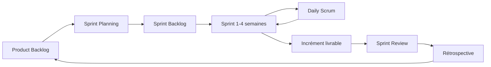

> *Figure 2.1 — Cycle de vie de la méthode SCRUM*

## 5. Planification des sprints et Backlog

Le projet a été découpé en sprints correspondant aux grands ensembles fonctionnels.

| Sprint | Nom du Sprint | Période estimée |
|--------|---------------|-----------------|
| Sprint 1 | Mise en place et configuration du projet (backend, frontend, BDD) | 1 semaine et 3 jours |
| Sprint 2 | Authentification et gestion des rôles | 1 semaine et 3 jours |
| Sprint 3 | Gestion pédagogique (spécialités, modules, sessions) | 1 semaine et 3 jours |
| Sprint 4 | Gestion des stagiaires et des enseignants | 1 semaine et 3 jours |
| Sprint 5 | Emplois du temps, assiduité et examens/notes | 2 semaines |
| Sprint 6 | Devoirs, documents, messagerie et délibérations | 1 semaine et 3 jours |
| Sprint 7 | Application mobile, chatbot, tableaux de bord et déploiement | 2 semaines |

> *Tableau 2.1 — Planification des sprints*

**Backlog résumé par sprint :**

- **Sprint 1 :** initialisation du dépôt, installation de Laravel, Vue.js, Tailwind, configuration MySQL et structure des migrations.
- **Sprint 2 :** table `users`, rôles (`student`, `teacher`, `administration`), login par numéro d'inscription/email, middlewares `CheckRole` et `CheckApproved`, workflow d'approbation.
- **Sprint 3 :** CRUD spécialités et modules, gestion des sessions/promotions, association spécialité–session.
- **Sprint 4 :** génération des numéros d'inscription, inscription en ligne, gestion et approbation des stagiaires, gestion des enseignants, affectation enseignant–module.
- **Sprint 5 :** création des emplois du temps avec prévention des conflits, marquage de l'assiduité, création des examens et saisie des notes.
- **Sprint 6 :** devoirs (création/soumission/notation), distribution de documents ciblée, messagerie/diffusion, délibérations.
- **Sprint 7 :** application mobile Flutter (stagiaire/enseignant), intégration du chatbot Gemini, tableaux de bord statistiques, tests et déploiement.

### Diagramme de planification des sprints

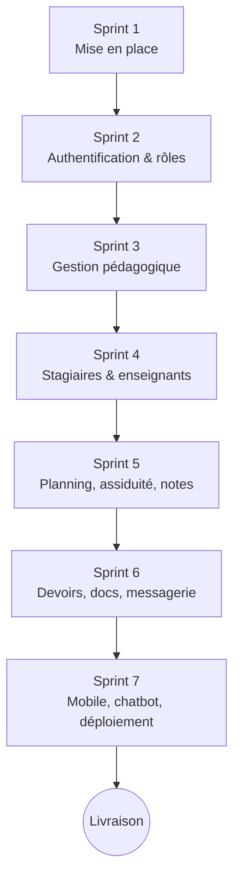

> *Figure 2.2 — Diagramme de planification des sprints*

## 6. Identification des acteurs

Un **acteur** est une entité (personne physique ou système) qui interagit avec le système. L'étude des postes de travail a permis d'identifier les acteurs suivants :

**Fiche acteur : Administrateur / Administration**
- **Rôle :** `administration`
- **Responsabilités :** supervision globale, gestion des comptes, des spécialités, modules, sessions, numéros d'inscription, emplois du temps, documents, messagerie et délibérations.

**Fiche acteur : Enseignant (Formateur)**
- **Rôle :** `teacher`
- **Responsabilités :** consultation des modules et des stagiaires, dépôt de cours, gestion de l'assiduité, des examens, des notes et des devoirs, messagerie.

**Fiche acteur : Stagiaire (Apprenant)**
- **Rôle :** `student`
- **Responsabilités :** inscription, consultation de l'emploi du temps, des notes, de l'assiduité, des documents et des délibérations, soumission de devoirs, messagerie.

**Fiche acteur : Système externe (API Gemini)**
- **Rôle :** service externe d'IA
- **Responsabilités :** répondre aux requêtes du chatbot.

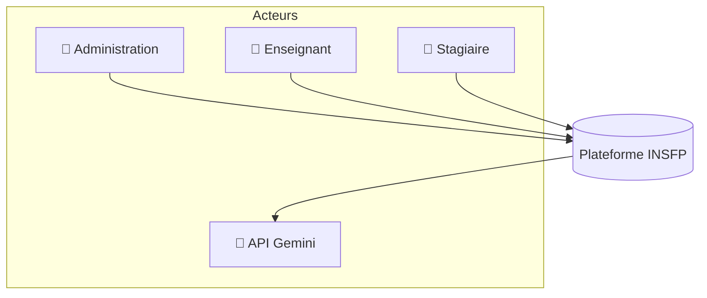

> *Figure 2.3 — Vue contextuelle des acteurs du système*

---
---

# Chapitre III : Conception et Modélisation

## 1. Introduction

L'étude préalable et l'analyse des besoins ont permis de définir le cadre fonctionnel et méthodologique du projet. Ce chapitre est consacré à la **phase de conception technique** de la plateforme. Nous adoptons le langage **UML (Unified Modeling Language)** pour structurer et planifier la solution : les diagrammes de cas d'utilisation, de séquence, d'activité et de classes permettent d'analyser les besoins fonctionnels et de concevoir la structure statique (classes, données) et dynamique (interactions) du système. Cette modélisation rigoureuse assure une meilleure compréhension du projet et sert de guide à la phase de réalisation.

## 2. Le langage de modélisation UML

L'**UML** est un langage de modélisation graphique standardisé qui permet de **visualiser, spécifier, construire et documenter** l'architecture, le comportement et la structure d'un système logiciel. La modélisation avant la réalisation permet de :

- comprendre le fonctionnement du système et maîtriser sa complexité ;
- établir un langage commun entre les membres de l'équipe ;
- assurer un bon niveau de qualité et une maintenance efficace.

Les principaux diagrammes utilisés dans ce projet sont :

- **Diagramme de cas d'utilisation** : recense les fonctionnalités du système et les acteurs qui y interagissent.
- **Diagramme de séquence** : modélise l'ordre chronologique des échanges de messages entre objets pour un scénario donné.
- **Diagramme d'activité** : représente l'enchaînement des actions au sein d'un processus (workflow).
- **Diagramme de classes** : représente la structure statique du système (classes, attributs, méthodes, relations).

## 3. Diagrammes de cas d'utilisation

Le diagramme de cas d'utilisation répond à trois questions : à quoi sert le système, qui l'utilise, et où s'arrête sa responsabilité. Il comprend la **frontière du système**, les **acteurs**, les **cas d'utilisation** et les **relations** (`include`, `extend`, généralisation).

### 3.1 Diagramme de cas d'utilisation global

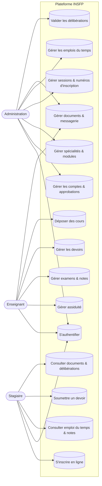

> *Figure 3.1 — Diagramme de cas d'utilisation global*

### 3.2 Description des scénarios des cas d'utilisation

**Cas d'utilisation : Créer un compte / S'inscrire**

| Élément | Description |
|---|---|
| **Cas d'utilisation** | S'inscrire en ligne |
| **Acteur** | Stagiaire |
| **Résumé** | Permettre au stagiaire de créer son compte à l'aide d'un numéro d'inscription valide |
| **Scénario** | 1. Le stagiaire clique sur « Créer un compte ». 2. Le système affiche le formulaire d'inscription. 3. Le stagiaire saisit son numéro d'inscription et ses informations. 4. Le système vérifie que le numéro existe et n'est pas déjà utilisé. 5. Le compte est créé en état « non approuvé » et un message de confirmation s'affiche. |

**Cas d'utilisation : S'authentifier**

| Élément | Description |
|---|---|
| **Cas d'utilisation** | Authentification |
| **Acteur** | Utilisateur (stagiaire, enseignant, administration) |
| **Résumé** | Permettre à un utilisateur de se connecter à la plateforme |
| **Pré-conditions** | L'utilisateur dispose d'un compte valide et approuvé |
| **Scénario nominal** | 1. L'utilisateur accède à la page de connexion. 2. Il saisit son identifiant (numéro d'inscription ou email) et son mot de passe. 3. Le système vérifie les informations et le statut d'approbation. 4. Si valides, un jeton est délivré et l'utilisateur est redirigé vers son tableau de bord selon son rôle. |
| **Scénario alternatif** | Informations erronées → message d'échec ; compte non approuvé → message « compte en attente de validation ». |

**Cas d'utilisation : Saisir les notes d'un examen**

| Élément | Description |
|---|---|
| **Cas d'utilisation** | Saisir les notes |
| **Acteur** | Enseignant |
| **Résumé** | Permettre à l'enseignant d'enregistrer les notes des stagiaires pour un examen |
| **Pré-conditions** | L'examen a été créé et associé à un module |
| **Scénario** | 1. L'enseignant sélectionne un examen. 2. Le système affiche la liste des stagiaires concernés. 3. L'enseignant saisit les notes. 4. Le système valide et enregistre les notes. 5. Les notes deviennent consultables par les stagiaires. |

**Cas d'utilisation : Valider une délibération**

| Élément | Description |
|---|---|
| **Cas d'utilisation** | Valider la délibération |
| **Acteur** | Administration |
| **Résumé** | Statuer sur la réussite des stagiaires en fin de semestre |
| **Scénario** | 1. L'administration consulte les moyennes du semestre. 2. Le système calcule/affiche la moyenne par stagiaire. 3. L'administration valide le résultat (admis / ajourné / rattrapage) et les observations. 4. Le résultat est enregistré et consultable par le stagiaire. |

## 4. Diagrammes de séquence

### 4.1 Diagramme de séquence : Authentification

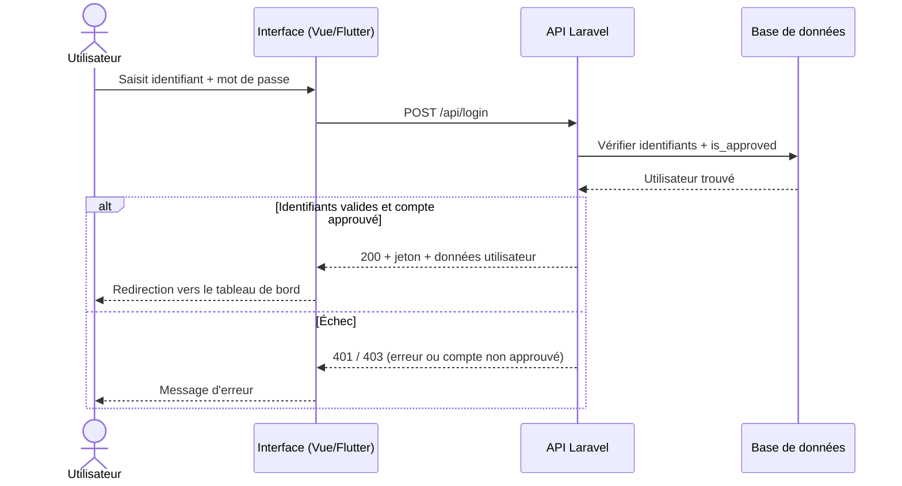

> *Figure 3.2 — Diagramme de séquence : Authentification*

### 4.2 Diagramme de séquence : Inscription en ligne d'un stagiaire

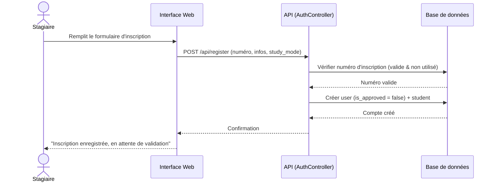

> *Figure 3.3 — Diagramme de séquence : Inscription en ligne*

### 4.3 Diagramme de séquence : Marquer l'assiduité

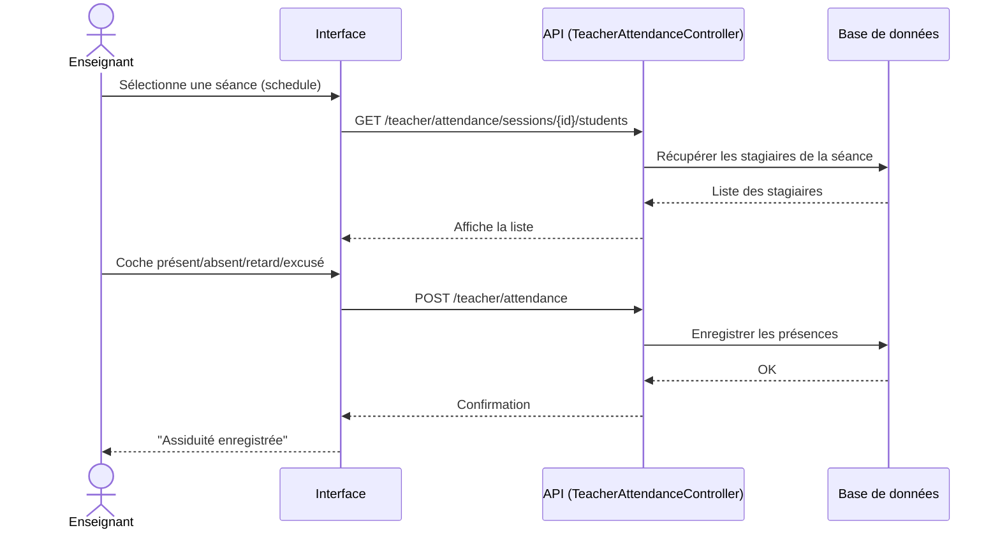

> *Figure 3.4 — Diagramme de séquence : Marquer l'assiduité*

### 4.4 Diagramme de séquence : Soumettre un devoir

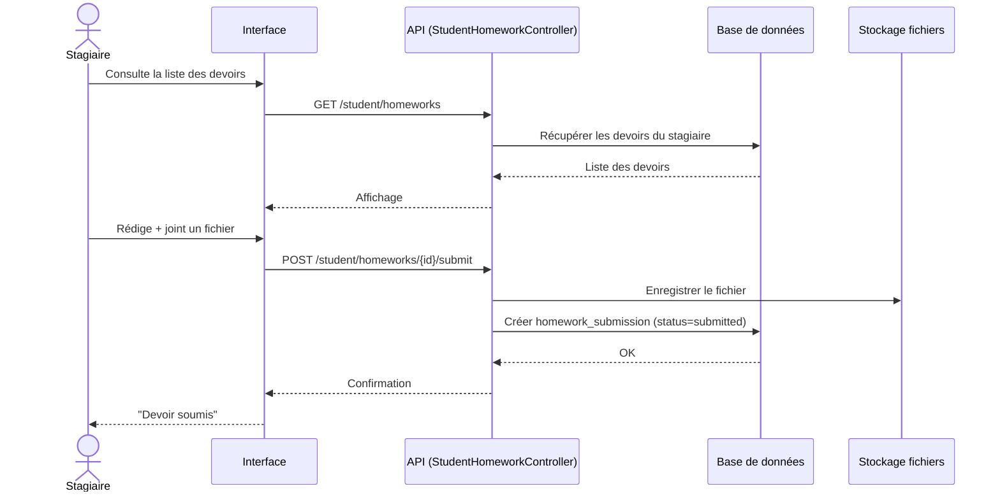

> *Figure 3.5 — Diagramme de séquence : Soumettre un devoir*

## 5. Diagramme d'activité

Le diagramme d'activité ci-dessous modélise le **processus complet de gestion d'un examen et de ses notes**, de la création jusqu'à la consultation par le stagiaire.

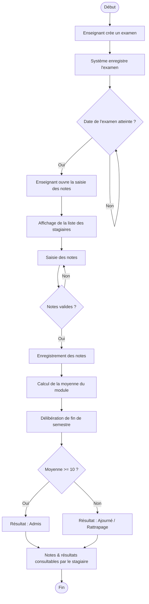

> *Figure 3.6 — Diagramme d'activité : Gestion des examens et des notes*

## 6. Diagramme de classes

Le diagramme de classes représente la structure logique du système : les classes (entités), leurs attributs et leurs relations.

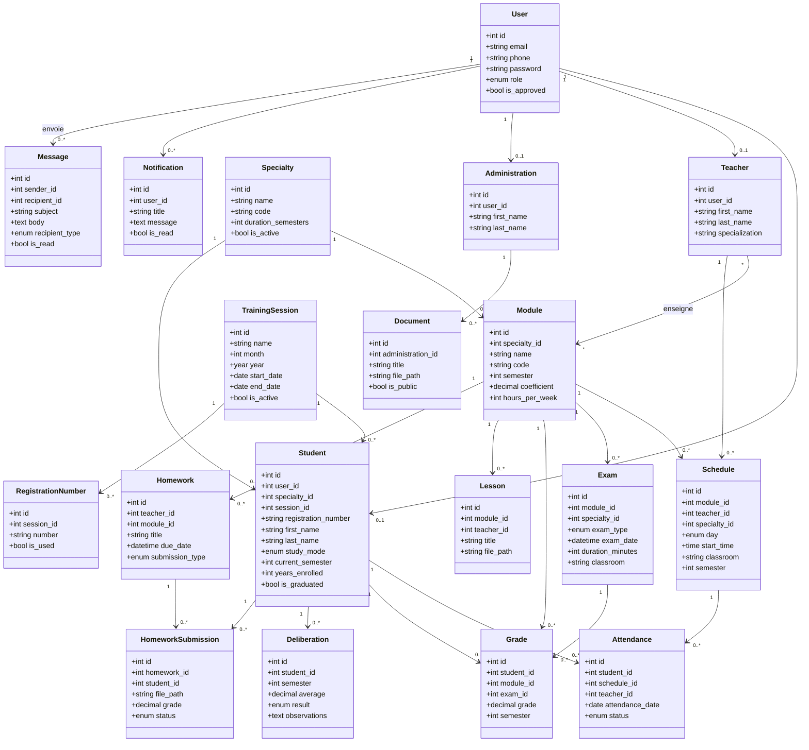

> *Figure 3.7 — Diagramme de classes de la plateforme INSFP*

### 6.1 Dictionnaire de données

| Donnée | Entité | Type | Taille | Observation |
|---|---|---|---|---|
| email | User | AN | 255 | Unique, nullable |
| phone | User | N | 20 | Unique, nullable |
| password | User | AN | 255 | Haché |
| role | User | A | — | student / teacher / administration |
| is_approved | User | Booléen | — | Validation du compte |
| registration_number | Student | AN | 50 | Unique |
| first_name / last_name | Student/Teacher | A | 100 | — |
| study_mode | Student | A | — | initial / alternance / continue |
| current_semester | Student | N | — | Semestre courant |
| is_graduated | Student | Booléen | — | Diplômé ou non |
| name | Specialty | A | 255 | Nom de la spécialité |
| code | Specialty/Module | AN | 50 | Code unique |
| duration_semesters | Specialty | N | — | Durée en semestres |
| coefficient | Module | N | 3,1 | Coefficient du module |
| hours_per_week | Module | N | — | Volume horaire |
| month / year | TrainingSession | N | — | Période de la session |
| start_date / end_date | TrainingSession | Date | — | Dates de la promotion |
| day | Schedule | A | — | saturday … thursday |
| start_time | Schedule | Heure | — | Heure de début |
| classroom | Schedule/Exam | AN | 50 | Salle |
| attendance_date | Attendance | Date | — | Date de la séance |
| status | Attendance | A | — | present/absent/late/excused |
| exam_type | Exam | A | — | midterm/final/rattrapage |
| exam_date | Exam | Date+H | — | Date et heure |
| grade | Grade/HomeworkSubmission | N | 4,2 | Note sur 20 |
| average | Deliberation | N | 4,2 | Moyenne du semestre |
| result | Deliberation | A | — | passed/failed/rattrapage |
| due_date | Homework | Date+H | — | Échéance |
| submission_type | Homework | A | — | online / in_person |
| recipient_type | Message | A | — | all/students/teachers/specialty/individual |
| is_used | RegistrationNumber | Booléen | — | Numéro consommé |

> *Tableau 3.1 — Dictionnaire de données (extrait)*

### 6.2 Règles de gestion

1. Un **utilisateur** possède un et un seul rôle (stagiaire, enseignant ou administration).
2. Un **utilisateur** correspond à 0 ou 1 stagiaire, 0 ou 1 enseignant, 0 ou 1 administration.
3. Une **spécialité** regroupe 1 à plusieurs **modules** ; un module appartient à une seule spécialité.
4. Une **spécialité** accueille 0 à plusieurs **stagiaires** ; un stagiaire appartient à une seule spécialité.
5. Une **session (promotion)** regroupe 0 à plusieurs stagiaires et 0 à plusieurs numéros d'inscription.
6. Un **enseignant** enseigne 0 à plusieurs **modules**, et un module peut être enseigné par plusieurs enseignants (relation plusieurs-à-plusieurs).
7. Un **module** possède 0 à plusieurs **séances** dans l'emploi du temps, 0 à plusieurs **examens**, **cours** et **devoirs**.
8. Une **séance** génère 0 à plusieurs enregistrements d'**assiduité** ; un stagiaire a 0 à plusieurs présences.
9. Un **examen** donne lieu à 0 à plusieurs **notes** ; une note concerne un stagiaire, un module et éventuellement un examen.
10. Un **stagiaire** reçoit 0 à plusieurs **délibérations** (une par semestre/année).
11. Un **devoir** reçoit 0 à plusieurs **soumissions** ; un stagiaire ne soumet qu'une fois par devoir (contrainte d'unicité).
12. L'**administration** publie 0 à plusieurs **documents**.
13. Un **utilisateur** envoie/reçoit 0 à plusieurs **messages** et reçoit 0 à plusieurs **notifications**.

## 7. Modèle relationnel

Le passage du diagramme de classes au modèle relationnel suit les règles classiques : chaque classe devient une **table**, chaque attribut une **colonne**, les associations *un-à-plusieurs* sont traduites par une **clé étrangère** dans la table « plusieurs », et les associations *plusieurs-à-plusieurs* par une **table de jointure**.

```text
users (id, email, phone, password, role, is_approved, timestamps)
specialties (id, name, code, description, duration_semesters, is_active, ...)
students (id, #user_id, #specialty_id, #session_id, registration_number, first_name,
          last_name, study_mode, current_semester, years_enrolled, is_graduated)
teachers (id, #user_id, first_name, last_name, specialization)
administrations (id, #user_id, first_name, last_name)
modules (id, #specialty_id, name, code, semester, coefficient, hours_per_week)
teacher_module (#teacher_id, #module_id)     -- table de jointure
training_sessions (id, name, month, year, start_date, end_date, is_active)
session_specialties (id, #session_id, #specialty_id)
registration_numbers (id, #session_id, number, is_used)
schedules (id, #module_id, #teacher_id, #specialty_id, day, start_time, classroom, semester)
attendances (id, #student_id, #schedule_id, #teacher_id, attendance_date, status, notes)
exams (id, #module_id, #specialty_id, exam_type, exam_date, duration_minutes, classroom)
grades (id, #student_id, #module_id, #exam_id, grade, semester, academic_year)
deliberations (id, #student_id, semester, academic_year, average, result, observations)
homeworks (id, #teacher_id, #module_id, title, description, due_date, submission_type)
homework_submissions (id, #homework_id, #student_id, submission_text, file_path, grade, status)
lessons (id, #module_id, #teacher_id, title, file_path, file_name)
documents (id, #administration_id, title, file_path, is_public, valid_until)
messages (id, #sender_id, #recipient_id, subject, body, recipient_type, is_read)
notifications (id, #user_id, title, message, type, is_read)
```

> *(# = clé étrangère)*
> *Schéma 3.1 — Modèle relationnel de la base de données*

## 8. Conception des interfaces

### 8.1 Arborescence de l'application

```mermaid
graph TD
    Root[Plateforme INSFP] --> Auth[Authentification]
    Auth --> Login[Connexion]
    Auth --> Reg[Inscription]
    Root --> Admin[Espace Administration]
    Root --> Teach[Espace Enseignant]
    Root --> Stud[Espace Stagiaire]
    Admin --> A1[Tableau de bord]
    Admin --> A2[Stagiaires]
    Admin --> A3[Enseignants]
    Admin --> A4[Spécialités & Modules]
    Admin --> A5[Sessions & Inscriptions]
    Admin --> A6[Emplois du temps]
    Admin --> A7[Documents & Messagerie]
    Admin --> A8[Délibérations]
    Teach --> T1[Tableau de bord]
    Teach --> T2[Modules & Stagiaires]
    Teach --> T3[Assiduité]
    Teach --> T4[Examens & Notes]
    Teach --> T5[Devoirs]
    Teach --> T6[Cours & Documents]
    Stud --> S1[Tableau de bord]
    Stud --> S2[Emploi du temps]
    Stud --> S3[Cours & Notes]
    Stud --> S4[Assiduité]
    Stud --> S5[Devoirs]
    Stud --> S6[Documents & Délibérations]
```

> *Figure 3.8 — Arborescence de la plateforme*

### 8.2 Maquettes (Wireframes)

**Maquette de la page d'authentification :**

```text
+--------------------------------------------------+
|                     [ LOGO INSFP ]               |
|                                                  |
|                  Connexion                       |
|   Numéro d'inscription / Email : [____________]  |
|   Mot de passe                  : [____________]  |
|                                                  |
|                 [  Se connecter  ]               |
|                                                  |
|   Pas encore de compte ?  Créer un compte        |
+--------------------------------------------------+
```

**Maquette du tableau de bord administration :**

```text
+----------------------------------------------------------+
| [LOGO]  INSFP - Administration        🔔   👤 Profil  ⏻  |
+--------+-------------------------------------------------+
| Menu   |  Tableau de bord                                |
| - Dash | [ 320 ]    [ 28 ]     [ 12 ]      [ 6 ]         |
| - Stag.| Stagiaires Enseignants Modules   Spécialités    |
| - Ens. |                                                 |
| - Spéc.| [ Graphe : Stagiaires par spécialité ]          |
| - Sess.| [ Graphe : Enseignants par spécialité ]         |
| - Plan.|                                                 |
| - Docs |                                                 |
+--------+-------------------------------------------------+
```

> *Figures 3.9 et 3.10 — Maquettes de l'authentification et du tableau de bord*

### 8.3 Charte graphique

- **Palette de couleurs principale :** bleu institutionnel `#1E3A8A`, vert `#10B981` (succès), gris neutres, blanc `#FFFFFF`, noir `#000000`.
- **Typographie :** police sans-serif moderne (lisible et professionnelle).
- **Composants :** cartes (cards), tableaux filtrables, badges de statut, indicateurs de chargement, thème clair/sombre.

## 9. Architecture de la solution

La solution adopte une architecture **client-serveur** découpée en **API REST + clients**, conforme au modèle **3-tiers** :

- **Couche présentation** : application web **Vue.js** (SPA) et application mobile **Flutter**, qui consomment l'API.
- **Couche métier (logique applicative)** : API **Laravel** organisée selon le patron **MVC**, exposant des points d'accès (endpoints) REST sécurisés par jeton et middlewares de rôle.
- **Couche données** : base de données **MySQL**, accédée via l'ORM **Eloquent**.

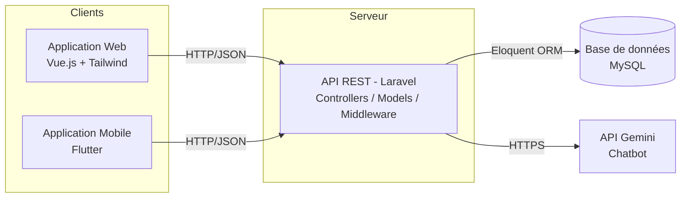

> *Figure 3.11 — Architecture 3-tiers de la solution*

---

# Chapitre IV : Réalisation

## 1. Introduction

Ce chapitre présente l'environnement de développement, les langages, frameworks et outils utilisés, ainsi que l'implémentation de la base de données et les principales interfaces de l'application, illustrées par des captures d'écran.

## 2. Langages, frameworks et outils utilisés

### 2.1 Langages et frameworks

**PHP / Laravel (Backend - API)**
Laravel est un framework PHP robuste et sécurisé, idéal pour construire une API RESTful. Il fournit un ORM (Eloquent), un système de migrations, un routage clair, une validation des requêtes et des middlewares. Dans notre projet, il implémente toute la logique métier et expose les endpoints consommés par le web et le mobile.

**JavaScript / Vue.js + Tailwind CSS (Frontend Web)**
Vue.js (avec Vite) est un framework JavaScript progressif permettant de construire des **Single Page Applications** réactives. Couplé à **Tailwind CSS** pour l'interface et à **Pinia** pour la gestion d'état, il offre une interface d'administration moderne, responsive et performante.

**Dart / Flutter (Application Mobile)**
Flutter est un framework de Google permettant la compilation **native** Android, iOS (et Windows) à partir d'un code source unique. Il est utilisé pour les espaces stagiaire et enseignant en mobilité.

**HTML / CSS**
Langages de base pour la structuration et la mise en forme des pages web.

**SQL / MySQL**
MySQL est un serveur de base de données relationnel rapide, robuste et open source, utilisé pour le stockage structuré des entités de l'institut.

### 2.2 Outils et bibliothèques

| Outil | Usage |
|---|---|
| **Visual Studio Code** | Éditeur de code principal |
| **Composer** | Gestionnaire de dépendances PHP |
| **npm / Vite** | Gestion des paquets et bundling du frontend |
| **Laragon** | Environnement de développement local (Apache, MySQL, PHP) |
| **Laravel Sanctum** | Authentification par jeton (API tokens) |
| **Pinia** | Gestion d'état côté Vue.js |
| **Axios** | Client HTTP (frontend) |
| **Git** | Gestion de versions |
| **API Gemini** | Service d'IA pour le chatbot |

### 2.3 Architecture technique du projet

Le dépôt est organisé en trois sous-projets :

- `backend/` : API Laravel (modèles, contrôleurs, migrations, routes).
- `frontend/` : application web Vue.js (vues admin, enseignant, stagiaire, stores Pinia, router).
- `mobile/` : application Flutter (écrans, services, configuration API).

## 3. Implémentation de la base de données

La base de données est implémentée via le système de **migrations** de Laravel, qui décrit chaque table en PHP et garantit sa reproductibilité.

**Exemple — Migration de la table `users` :**

```php
Schema::create('users', function (Blueprint $table) {
    $table->bigIncrements('id');
    $table->string('email', 255)->unique()->nullable();
    $table->string('phone', 20)->unique()->nullable();
    $table->string('password', 255);
    $table->enum('role', ['student', 'teacher', 'administration']);
    $table->boolean('is_approved')->default(false);
    $table->timestamps();
    $table->index(['role', 'is_approved']);
});
```

**Exemple — Migration de la table `students` :**

```php
Schema::create('students', function (Blueprint $table) {
    $table->bigIncrements('id');
    $table->unsignedBigInteger('user_id')->unique();
    $table->unsignedBigInteger('specialty_id');
    $table->string('registration_number', 50)->unique();
    $table->string('first_name', 100);
    $table->string('last_name', 100);
    $table->enum('study_mode', ['initial', 'alternance', 'continue'])->default('initial');
    $table->integer('current_semester')->default(1);
    $table->boolean('is_graduated')->default(false);
    $table->timestamps();
    $table->foreign('user_id')->references('id')->on('users')->onDelete('cascade');
    $table->foreign('specialty_id')->references('id')->on('specialties')->onDelete('restrict');
});
```

L'ensemble des tables (spécialités, modules, sessions, emplois du temps, assiduité, examens, notes, délibérations, devoirs, documents, messages, notifications, numéros d'inscription) est créé selon le même principe, avec les contraintes de clés étrangères, d'unicité et d'indexation décrites dans le dictionnaire de données.

## 4. Présentation des interfaces de l'application

> *Note : insérer ici les captures d'écran réelles de l'application. La liste ci-dessous indique les écrans à illustrer, déjà développés dans le projet.*

**Interfaces Web — Authentification**
- Page de connexion (`Login.vue`)
- Page d'inscription (`Register.vue`)

**Interfaces Web — Administration**
- Tableau de bord avec statistiques et graphiques (`Dashboard.vue`, `StatCard.vue`, `StudentBarChart.vue`, `TeacherBarChart.vue`)
- Gestion des stagiaires (`Students.vue`, `StudentDetails.vue`)
- Gestion des enseignants (`Teachers.vue`, `TeacherDetails.vue`)
- Gestion des spécialités et modules (`Specialties.vue`, `SpecialtyDetails.vue`)
- Gestion des sessions et générateur de numéros d'inscription (`Sessions.vue`, `RegistrationGenerator.vue`)
- Gestion des emplois du temps (`Schedule.vue`)
- Gestion des documents (`Files.vue`)
- Délibérations (`Deliberations.vue`) et examens/notes (`Exams.vue`, `ExamGrades.vue`)

**Interfaces Web — Enseignant**
- Tableau de bord, modules et stagiaires (`Dashboard.vue`, `Modules.vue`, `ModuleStudents.vue`)
- Marquage de l'assiduité (`MarkAttendance.vue`, `Attendance.vue`)
- Saisie des notes (`Grading.vue`), examens (`Exams.vue`)
- Gestion des devoirs (`Homeworks.vue`, `HomeworkDetail.vue`)
- Cours et documents (`Courses.vue`, `Documents.vue`)

**Interfaces Web — Stagiaire**
- Tableau de bord (`Dashboard.vue`)
- Emploi du temps (`Schedule.vue`), cours (`Courses.vue`), notes/examens (`Exams.vue`)
- Assiduité (`Attendance.vue`), devoirs (`Homeworks.vue`)
- Documents (`Documents.vue`), délibérations (`Deliberations.vue`), profil (`Profile.vue`)

**Interfaces Mobile (Flutter)**
- Connexion (`login_screen.dart`), tableau de bord (`dashboard_screen.dart`)
- Emploi du temps, cours, assiduité, examens, devoirs, documents, délibérations, messagerie.

---

# Conclusion Générale

Ce projet de fin d'étude nous a permis de concevoir et de réaliser une **plateforme web et mobile de gestion intégrée** pour l'Institut National Spécialisé de la Formation Professionnelle. À travers une démarche structurée — étude préalable, analyse des besoins, conception UML, puis réalisation — nous avons répondu à la problématique de la **centralisation et de la numérisation** des processus administratifs et pédagogiques de l'institut.

La solution développée couvre l'ensemble des activités clés : authentification et gestion des rôles, gestion des spécialités, modules, sessions et numéros d'inscription, inscription en ligne avec workflow d'approbation, gestion des emplois du temps, de l'assiduité, des examens, des notes, des devoirs, des délibérations, des documents, ainsi qu'une messagerie interne et un assistant intelligent (chatbot).

Sur le plan technique, ce travail nous a permis de mettre en pratique des technologies modernes et professionnelles : **Laravel** pour une API REST sécurisée, **Vue.js** et **Tailwind CSS** pour une interface web réactive, **Flutter** pour une application mobile multiplateforme, et **MySQL** pour le stockage des données. La méthodologie **agile SCRUM** nous a aidés à organiser le travail de façon itérative et incrémentale.

**Perspectives d'évolution :**
- Génération automatique de documents officiels (attestations, relevés de notes) au format PDF et export Excel des listes.
- Notifications push en temps réel sur mobile (ajout de note, changement d'emploi du temps, rappels de devoirs).
- Extension du chatbot et tableaux de bord analytiques plus poussés (taux de réussite, prédiction d'abandon).
- Module de gestion de l'encadrement et des projets de fin d'étude (déjà amorcé dans la base de données via les tables `encadrement_*`).
- Déploiement en production sur un serveur dédié et rédaction d'un manuel utilisateur.

Ce projet constitue une base solide et évolutive, et l'expérience acquise — tant sur le plan technique que méthodologique — représente un atout précieux pour notre future carrière professionnelle.

---
